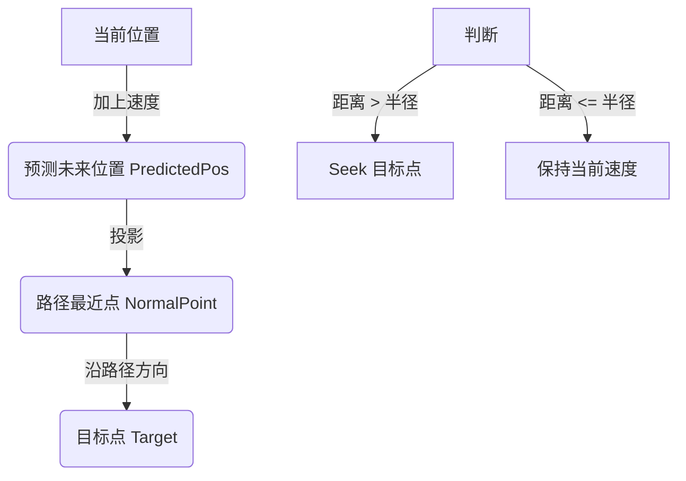
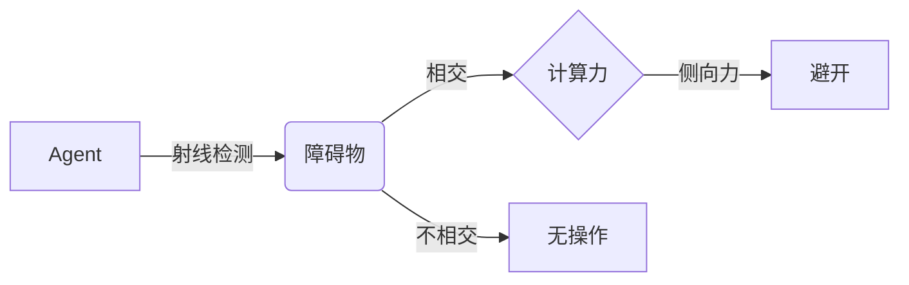

# 游戏AI进阶：高级操控行为 (Advanced Steering Behaviors)


在上一篇文章中，我们介绍了 Seek, Flee, Arrive 和 Wander 等基础操控行为。这些行为虽然能让角色动起来，但它们大多是基于“点”的移动。但在实际游戏中，我们往往需要更复杂的环境交互，比如让角色沿着一条蜿蜒的小径巡逻，或者在充满障碍物的森林中穿梭而不撞树。

本文将介绍两个更高级的操控行为：**路径跟随 (Path Following)** 和 **避障 (Collision Avoidance)**。

## 1. 路径跟随 (Path Following)

**寻找 (Seek)** 行为只能让角色直线奔向目标，但如果我们要让角色沿着一条特定的路线（比如巡逻路线或赛道）移动，简单的 Seek 就不够用了。

### 核心原理

“路径跟随”的核心思想不是死板地走在直线上，而是像驾驶员一样：**看着前方的路**。



算法步骤如下：
1.  **预测未来位置**：根据当前速度，预测角色在未来一小段时间（例如 20 帧）后的位置 `PredictedPosition`。
2.  **寻找最近点**：在路径的所有线段上，找到离 `PredictedPosition` 最近的点，在这个点上沿着路径方向往前延伸一段距离，设为 **目标点 (Target)**。
3.  **施加操控力**：如果 `PredictedPosition` 偏离路径太远（超过路径半径），就对这个 **目标点** 执行 **Seek** 行为。如果还在路径范围内，就不做干预，让角色保持当前惯性。

### 代码实现

假设我们的路径由一系列点组成（Segments）：

```javascript
followPath(path) {
    // 1. 预测未来位置
    const predict = this.velocity.copy();
    predict.normalize();
    predict.mult(25); // 预测前瞻距离
    const predictPos = Vector2.add(this.position, predict);

    let normal = null;
    let target = null;
    let worldRecord = 1000000; // 记录最近的距离

    // 2. 遍历路径所有路段，找到最近的投影点
    for (let i = 0; i < path.points.length - 1; i++) {
        const a = path.points[i];
        const b = path.points[i + 1];

        // 获取预测点在当前线段上的投影点（法线点）
        let normalPoint = getNormalPoint(predictPos, a, b);

        // 如果投影点落在线段外，取端点
        if (normalPoint.x < Math.min(a.x, b.x) || normalPoint.x > Math.max(a.x, b.x)) {
            normalPoint = b.copy();
        }

        const distance = Vector2.dist(predictPos, normalPoint);

        // 找到最近的那个线段
        if (distance < worldRecord) {
            worldRecord = distance;
            normal = normalPoint;

            // 在路径上往前找一点作为目标
            const dir = Vector2.sub(b, a);
            dir.normalize();
            dir.mult(10); // 目标点前瞻距离
            target = Vector2.add(normalPoint, dir);
        }
    }

    // 3. 只有当偏离路径太远时才施力
    if (worldRecord > path.radius) {
        return this.seek(target);
    } else {
        return new Vector2(0, 0);
    }
}

// 辅助函数：计算点 p 到线段 ab 的垂足
function getNormalPoint(p, a, b) {
    const ap = Vector2.sub(p, a);
    const ab = Vector2.sub(b, a);
    ab.normalize();
    ab.mult(ap.dot(ab));
    return Vector2.add(a, ab);
}
```

---

## 2. 避障 (Collision Avoidance)

简单的 **分离 (Separation)** 行为可以防止角色重叠，但它只基于距离。如果你面对一堵墙，当你“距离”墙很近时再躲避通常已经来不及了。

真正的 **避障** 需要“看到”前方的障碍物。我们使用 **射线检测 (Ray Casting)** 或 **触须 (Feelers)** 的概念。

### 核心原理

想象角色前方长出了一根“探针”（向量）：
1.  **投射探针**：主要的一根探针指向速度前方。通常长度与当前速度成正比（跑得越快，看地越远）。
2.  **检测相交**：检测这根探针是否与场景中的障碍物（圆或矩形）相交。
3.  **计算侧向力**：如果发现相交，说明即将撞上。我们需要计算一个侧向力来避开它。
    -   力的大小通常与“最近的碰撞点”距离有关（越近越急）。
    -   力的方向应垂直于障碍物表面或直接把角色“推”开。



### 代码实现

最简单的“圆形障碍物”检测逻辑：

```javascript
avoid(obstacles) {
    const feeler = this.velocity.copy();
    feeler.normalize();
    feeler.mult(50); // 探针长度

    // 各种对障碍物的检测变量
    let mostThreatening = null;
    let normal = null; // 障碍物法线

    // 检查所有障碍物
    for (const obs of obstacles) {
        // ... (此处省略复杂的线圆相交数学计算)
        // 核心是判断：
        // 1. 障碍物是否在探针方向上？
        // 2. 障碍物是否足够近，并且与探针这根线段相交？
        
        if (collision) {
             mostThreatening = obs;
        }
    }

    // 如果检测到威胁
    if (mostThreatening != null) {
        // 产生一个侧向力躲避
        // 这里的力是： 探针前方 - 障碍物中心 
        // 意思就是：想办法往障碍物旁边偏
        const avoidForce = Vector2.sub(ahead, mostThreatening.center); 
        avoidForce.normalize();
        avoidForce.mult(this.maxAvoidForce);
        return avoidForce;
    } else {
        return new Vector2(0, 0);
    }
}
```

### 多触须 (Multi-Feelers)

为了不被“擦肩而过”的墙角挂住，通常我们会给角色加三根触须：
-   一根在正前方（最长）。
-   两根在侧前方 45 度左右（稍短）。

这样角色就能感知到侧面的威胁，在穿过狭窄通道时表现得更智能。

## 总结

**路径跟随** 和 **避障** 是让 AI 角色表现出“感知环境”能力的关键。
-   **Seek** 只是盲目地跑。
-   **Path Following** 让跑动有了规划。
-   **Collision Avoidance** 让跑动变得安全。

将这些力（Seek, Arrive, Separate, Follow, Avoid）根据权重累加起来 `acceleration.add(force * weight)`，一个栩栩如生的智能体就诞生了。

reference:https://edirlei.com/aulas/game-ai-2020/GAME_AI_Lecture_07_Steering_Behaviours_2020.html 
