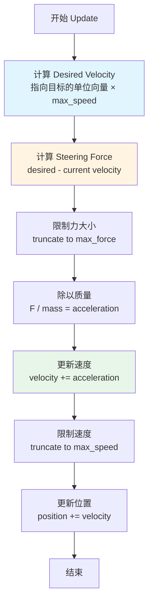

# Seek (寻找) 行为

## 概念总结 (Concept Overview)

> [!abstract] 核心思想
> **Seek** 是最基础的转向行为，通过施加力 (Force) 而非直接设置速度，让角色平滑地向目标移动。这种基于物理的方法模拟了惯性，使运动看起来自然真实。

**与直接赋值的区别：**
- ❌ **直接赋值**：`velocity = normalize(target - position) * maxSpeed` → 瞬间转向，不真实
- ✅ **Steering Force**：通过力逐帧修正 velocity → 平滑转向，有惯性感

---

## 核心公式推导 (Formula Derivation)

### 步骤 1: 计算期望速度 (Desired Velocity)

期望速度是从当前位置指向目标的最短路径方向，以最大速度缩放。

$$
\vec{v}_{desired} = \frac{\vec{target} - \vec{position}}{|\vec{target} - \vec{position}|} \times v_{max}
$$

```javascript
desired_velocity = normalize(target - position) * max_velocity
```

> [!tip] 理解
> 这个向量代表"如果能瞬移，我应该以多快的速度朝哪个方向移动"。

### 步骤 2: 计算操控力 (Steering Force)

操控力是为了让角色从"当前状态"变为"期望状态"所需施加的力。

$$
\vec{F}_{steering} = \vec{v}_{desired} - \vec{v}_{current}
$$

```javascript
steering = desired_velocity - velocity
```

> [!important] 关键洞察
> 这是一个**差值 (Delta)**，它会**逐渐**修正当前速度。如果当前速度已经接近期望速度，steering force 就会很小。

### 步骤 3: 应用力到速度 (Apply Force)

物理模拟：考虑质量 (Mass) 的影响。

$$
\vec{F}_{steering} = \text{truncate}(\vec{F}_{steering}, F_{max})
$$

$$
\vec{a} = \frac{\vec{F}_{steering}}{m}
$$

$$
\vec{v}_{new} = \text{truncate}(\vec{v}_{current} + \vec{a}, v_{max})
$$

$$
\vec{pos}_{new} = \vec{pos}_{current} + \vec{v}_{new}
$$

```javascript
steering = truncate(steering, max_force)
steering = steering / mass
velocity = truncate(velocity + steering, max_speed)
position = position + velocity
```

---

## 可视化流程 (Visual Flow)



---

## 参数调整指南 (Parameter Tuning)

| 参数 | 作用 | 调高效果 | 调低效果 |
|------|------|---------|---------|
| **Max Speed** | 最大移动速度 | 跑得更快 | 跑得更慢 |
| **Max Force** | 最大转向力 | 转向更灵活敏捷 (像跑车) | 转向迟钝 (像重卡) |
| **Mass** | 质量 | 转向更迟钝 (惯性大) | 转向更灵活 |

> [!example] 实践建议
> - **追逐者 (Chaser)**: `mass=10, max_force=1.0, max_speed=5` → 快速且灵活
> - **坦克 (Tank)**: `mass=50, max_force=0.3, max_speed=2` → 缓慢且笨重
> - **幽灵 (Ghost)**: `mass=5, max_force=2.0, max_speed=4` → 轻盈飘忽

---

## 常见问题 (FAQ)

> [!question] 为什么不直接设置 velocity？
> 直接设置会导致瞬间转向，角色会像"卡顿的机器人"。Steering Force 通过每帧微调，产生平滑过渡。

> [!question] Max Force 和 Max Speed 的区别？
> - **Max Speed**: 限制"能跑多快"
> - **Max Force**: 限制"能转多快"（加速度上限）

> [!question] 为什么要除以 Mass？
> 牛顿第二定律 $F = ma$，即 $a = F/m$。质量越大，相同的力产生的加速度越小，转向越慢。

---

## 实际应用场景 (Use Cases)

- 🎮 **游戏 AI**：敌人追逐玩家
- 🚗 **车辆模拟**：车辆转向目标停车位
- 🐦 **群体动画**：鸟类飞向栖息地
- 🎯 **导弹制导**：寻的导弹锁定目标

---

## 相关链接

- Next: [[02_Flee_Arrival|Flee & Arrival]]
- See also: [[04_Pursuit_Evade|Pursuit]] (Seek 的预测版本)
- Demo: [[demo/index.html|Interactive Demo]]

---

## 参考资料

- [Craig Reynolds: Steering Behaviors](https://www.red3d.com/cwr/steer/)
- [TutsPlus Tutorial](https://gamedevelopment.tutsplus.com/understanding-steering-behaviors-seek--gamedev-849t)
