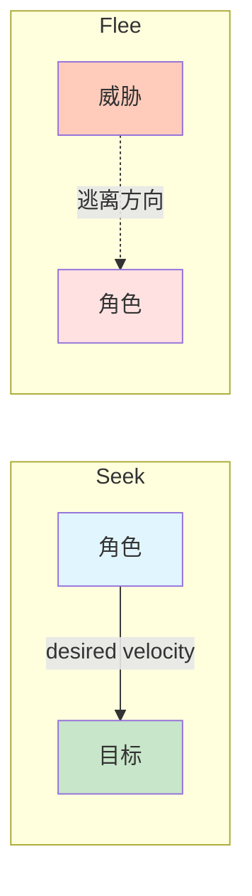
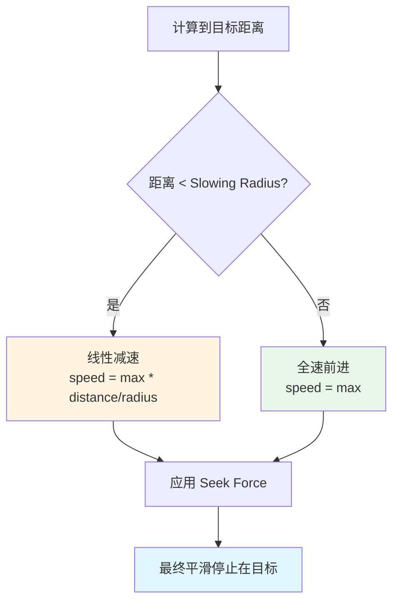
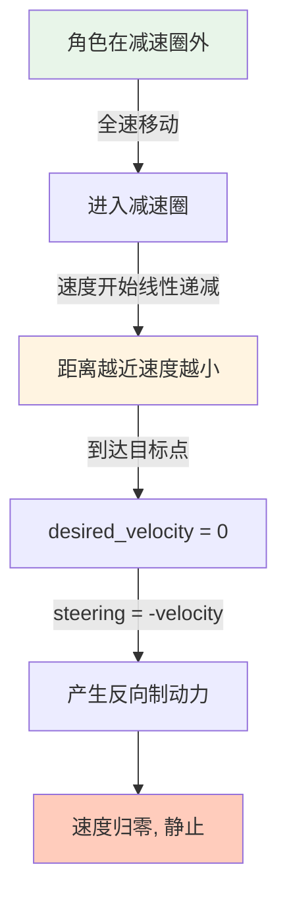

# Flee (逃离) & Arrival (抵达)

## 概念总结 (Concept Overview)

> [!abstract] 核心思想
> - **Flee**: Seek 的镜像行为，逃离威胁而非追逐目标
> - **Arrival**: Seek 的升级版，接近目标时会减速并优雅停止

---

## Flee (逃离行为)

### 公式推导

Flee 与 Seek 唯一的区别在于 **Desired Velocity 的方向相反**。

$$
\vec{v}_{desired} = \frac{\vec{position} - \vec{target}}{|\vec{position} - \vec{target}|} \times v_{max}
$$

```javascript
// Seek: desired = target - position
// Flee: desired = position - target (相反!)
desired_velocity = normalize(position - target) * max_velocity
steering = desired_velocity - velocity
```

> [!tip] 数学关系
> `flee_desired_velocity = -seek_desired_velocity`
> 
> 即 Flee 的期望速度是 Seek 期望速度的负向量。

### 对比图示



### 应用场景

- 🏃 **逃离追捕**: 猎物逃离捕食者
- 💥 **爆炸反应**: 角色远离爆炸中心
- 🛡️ **安全区域**: AI 撤离危险区域

---

## Arrival (抵达行为)

### 问题分析

> [!warning] Seek 的缺陷
> 单纯的 Seek 会让角色**全速冲向目标**，到达后会因为惯性穿越目标，然后回头，形成"弹簧式震荡"。

**解决方案**: 引入**减速区 (Slowing Radius)**。

### 逻辑流程图



### 公式实现

$$
distance = |\vec{target} - \vec{position}|
$$

$$
speed = 
\begin{cases} 
v_{max} \times \frac{distance}{r_{slowing}} & \text{if } distance < r_{slowing} \\
v_{max} & \text{otherwise}
\end{cases}
$$

$$
\vec{v}_{desired} = \text{normalize}(\vec{target} - \vec{position}) \times speed
$$

```javascript
target_offset = target - position
distance = length(target_offset)

if (distance < slowing_radius) {
    // 线性插值: 距离越近，速度越慢
    speed = max_velocity * (distance / slowing_radius)
} else {
    speed = max_velocity
}

desired_velocity = normalize(target_offset) * speed
steering = desired_velocity - velocity
```

> [!important] 关键参数
> **Slowing Radius** 决定了减速区的大小：
> - 半径越大 → 减速越早，停得越平滑
> - 半径越小 → 急刹车效果

### 停止机制可视化



### 参数推荐

| 场景 | Slowing Radius | 效果 |
|------|---------------|------|
| 精确停车 | 50-100 | 提前减速，平滑停止 |
| 敏捷动作 | 20-30 | 最后一刻减速，快速停止 |
| 大型载具 | 150-300 | 大范围减速区，避免急刹 |

---

## 实际应用对比

| 行为 | 目标检测 | 运动特征 | 典型场景 |
|------|---------|---------|---------|
| **Seek** | 追逐 | 永不停止 | 导弹追踪, 僵尸追人 |
| **Flee** | 逃离 | 永远远离 | 猎物逃跑, NPC 撤离 |
| **Arrival** | 抵达 | 减速停止 | 车辆停车, 角色归位 |

---

## 相关链接

- Previous: [[01_Seek|Seek]]
- Next: [[03_Wander|Wander]]
- Compare: [[04_Pursuit_Evade|Pursuit vs Seek]]

---

## 参考资料

- [TutsPlus: Flee and Arrival](https://code.tutsplus.com/understanding-steering-behaviors-flee-and-arrival--gamedev-1303t)
