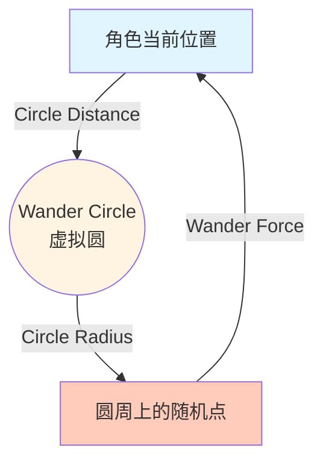
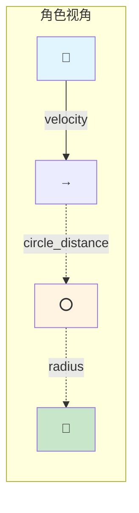
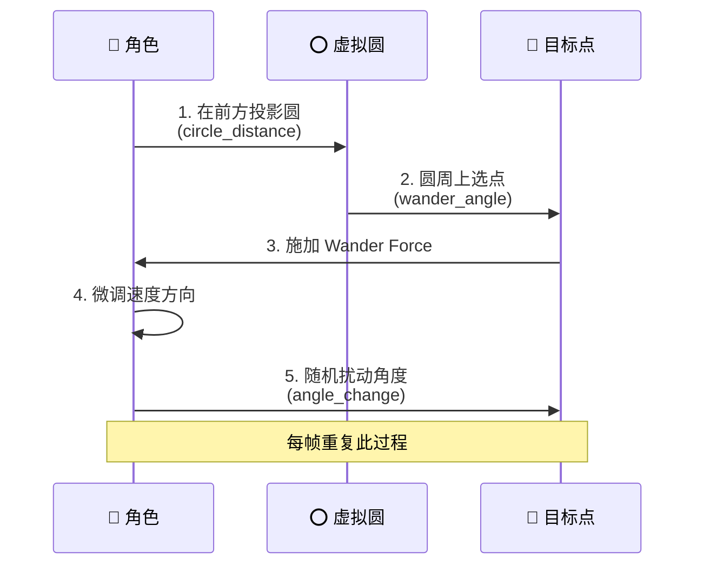

# Wander (徘徊) 行为

## 概念总结 (Concept Overview)

> [!abstract] 核心思想
> **Wander** 通过在角色前方投射一个虚拟圆，并在圆周上随机选点来产生平滑的随机移动。这避免了简单随机 Seek 造成的"忘带钥匙"式掉头。

**朴素实现的问题：**
- ❌ **Random Seek**: 每隔几秒随机生成目标点 → 角色会突然 180° 掉头，不自然
- ✅ **Wander Circle**: 每帧微调方向 → 产生平滑曲线路径

---

## Wander Circle 算法详解

### 概念图示



### 几何结构



> [!tip] 关键参数
> - **Circle Distance** (圆心距离): 圆离角色多远
> - **Circle Radius** (圆半径): 圆有多大
> - **Angle Change** (角度扰动): 每帧角度变化量

---

## 计算步骤详解

### 步骤 1: 计算圆心位置 (Circle Center)

圆心位于角色**前方** `circle_distance` 单位处，方向沿着当前 `velocity`。

$$
\vec{center} = \text{normalize}(\vec{velocity}) \times d_{circle}
$$

```javascript
circle_center = velocity.clone()
circle_center.normalize()
circle_center.scale(CIRCLE_DISTANCE)
```

### 步骤 2: 计算位移向量 (Displacement)

从圆心指向圆周上某一点的向量，由 **wander_angle** 控制。

$$
\vec{displacement} = \begin{bmatrix} \cos(\theta) \\ \sin(\theta) \end{bmatrix} \times r_{circle}
$$

```javascript
displacement = new Vector(0, -1)  // 初始向上
displacement.scale(CIRCLE_RADIUS)
setAngle(displacement, wander_angle)
```

### 步骤 3: 随机扰动角度 (Random Perturbation)

每帧给 `wander_angle` 加上一个小的随机值 $\Delta\theta \in [-\frac{c}{2}, +\frac{c}{2}]$。

$$
\theta_{new} = \theta_{old} + \text{random}(-\frac{c}{2}, +\frac{c}{2})
$$

```javascript
wander_angle += (Math.random() * ANGLE_CHANGE) - (ANGLE_CHANGE * 0.5)
```

> [!important] 平滑性的关键
> `ANGLE_CHANGE` 越小，转向越平滑；越大，路径越曲折。

### 步骤 4: 合成 Wander Force

$$
\vec{F}_{wander} = \vec{center} + \vec{displacement}
$$

```javascript
wander_force = circle_center.add(displacement)
```

---

## 可视化流程



---

## 参数调优指南

| 参数 | 增大效果 | 减小效果 | 推荐范围 |
|------|---------|---------|---------|
| **Circle Distance** | 路径更直 (提前预见) | 转弯更急 | 40-100 |
| **Circle Radius** | 转向幅度大 | 转向幅度小 | 10-30 |
| **Angle Change** | 路径曲折抖动 | 路径平滑稳定 | 0.3-1.0 |

### 效果对比

```mermaid
graph LR
    subgraph 大 Circle Distance
        A1[角色] ~~~|远距离预判| C1((圆))
        C1 -.较直的路径.-> A1
    end
    
    subgraph 小 Circle Distance
        A2[角色] ~|近距离| C2((圆))
        C2 -.急转弯路径.-> A2
    end
    
    style C1 fill:#e8f5e9
    style C2 fill:#ffccbc
```

---

## 实际应用

> [!example] 使用场景
> - 🐦 **NPC 闲逛**: 城镇居民随意走动
> - 🐟 **水下生物**: 鱼群的自然游动
> - 👾 **巡逻敌人**: 无目标时的漫步
> - 🌿 **粒子效果**: 飘散的树叶、灰尘

---

## 常见问题 (FAQ)

> [!question] 为什么不直接 Random Seek？
> Random Seek 会每隔几秒瞬间改变目标，导致角色突然掉头，像"忘了拿钥匙"一样。Wander 每帧微调，路径连续平滑。

> [!question] Wander 会让角色走出边界吗？
> 会！Wander 是**无目标**的运动。如果需要限制区域，可以添加 **Boundary Force** 或 **Collision Avoidance**。

> [!question] 如何让 Wander 更"疯狂"？
> 增大 `Circle Radius` 和 `Angle Change`，减小 `Circle Distance`。

---

## 相关链接

- Previous: [[02_Flee_Arrival|Flee & Arrival]]
- Next: [[04_Pursuit_Evade|Pursuit & Evade]]
- Combine with: [[06_Collision_Avoidance|Collision Avoidance]] (避免撞墙)

---

## 参考资料

- [TutsPlus: Wander](https://code.tutsplus.com/understanding-steering-behaviors-wander--gamedev-1624t)
- Craig Reynolds: "Wander is not a random walk" ^wander-ref

^wander-definition
