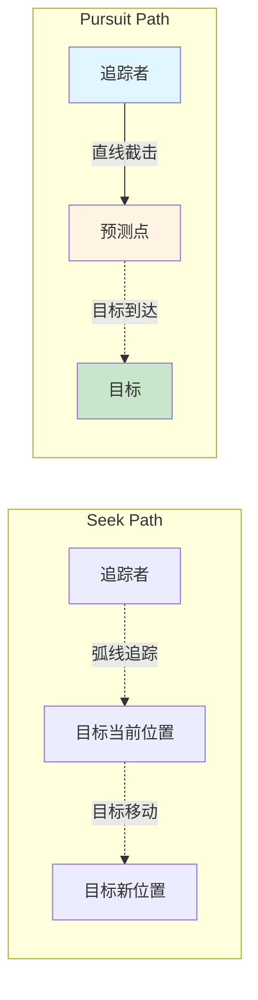
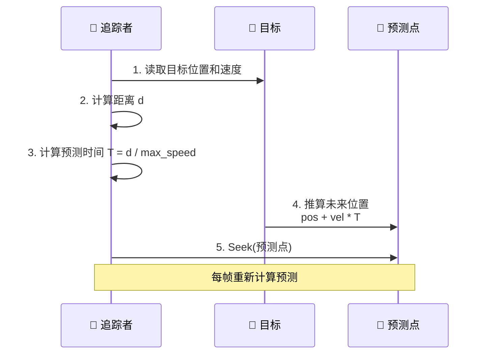
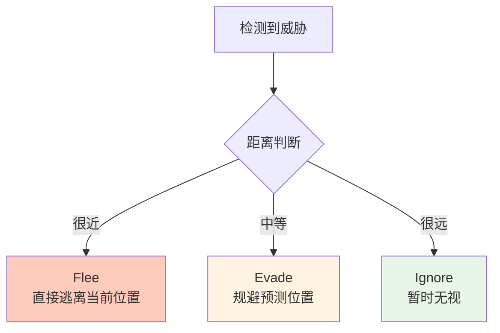
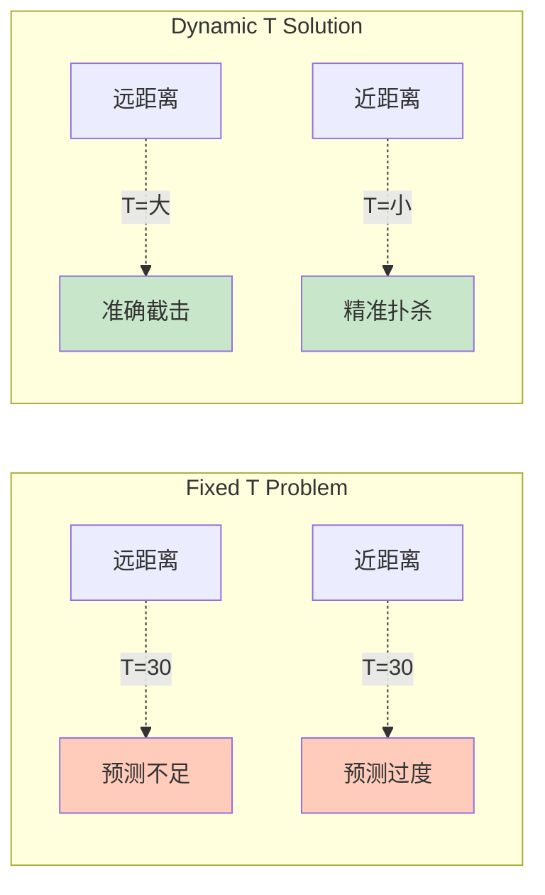

# Pursuit (追逐) & Evade (闪避)

## 概念总结 (Concept Overview)

> [!abstract] 核心思想
> **Pursuit** 和 **Evade** 是 **Seek** 和 **Flee** 的升级版，通过**预测目标未来位置**实现更智能的追逐和闪避。

**对比基础行为：**

| 行为 | 目标类型 | 运动模式 | 智能等级 |
|------|---------|---------|---------|
| **Seek** | 静态目标 | 追当前位置 | ⭐ 基础 |
| **Pursuit** | 移动目标 | 追预测位置 | ⭐⭐⭐ 截击 |
| **Flee** | 静态威胁 | 逃当前位置 | ⭐ 基础 |
| **Evade** | 移动威胁 | 逃预测位置 | ⭐⭐⭐ 规避 |

---

## 预测机制 (Prediction Mechanism)

### 核心洞察

> [!important] Why Prediction?
> 如果目标在移动，直接 Seek 会导致追踪者始终"吃尾气"，因为目标一直在往前跑。**Pursuit** 通过预测"目标会在哪"来实现截击。

### 预测公式

$$
\vec{pos}_{future} = \vec{pos}_{target} + \vec{v}_{target} \times T
$$

其中 $T$ (Look-ahead Time) 是关键：

$$
T = \frac{|\vec{pos}_{target} - \vec{pos}_{pursuer}|}{v_{max}}
$$

> [!tip] T 的意义
> $T$ 表示"按我的最大速度，追上目标需要多久"。距离越远，预测越远；距离越近，预测越少（直接扑）。

```javascript
distance_vec = target.position - pursuer.position
distance = length(distance_vec)

T = distance / pursuer.max_velocity

future_position = target.position + (target.velocity * T)

// 然后 Seek 这个 future_position
return seek(future_position)
```

---

## Pursuit (追逐行为)

### 路径对比图



### 工作流程



### 应用场景

- 🎮 **AI 对战**: 敌人预判玩家移动
- 🏀 **体育模拟**: 接球员预判落点
- 🚁 **军事模拟**: 防空导弹拦截飞机

---

## Evade (闪避行为)

### 概念

**Evade** = **Flee** + **Prediction**

不仅仅是逃离威胁当前位置，而是逃离威胁**即将到达**的位置。

### 公式

$$
\vec{pos}_{future} = \vec{pos}_{threat} + \vec{v}_{threat} \times T
$$

$$
\vec{F}_{evade} = \text{Flee}(\vec{pos}_{future})
$$

```javascript
distance = target.position - evader.position
T = distance.length() / evader.max_velocity

future_position = target.position + (target.velocity * T)

return flee(future_position)
```

### 战术对比



---

## 动态 T vs 固定 T

> [!danger] 固定 T 的问题
> 如果 `T = 30` (固定值)：
> - 距离远时：预测不够远，效果差
> - 距离近时：预测过远，会冲过头

> [!success] 动态 T 的优势
> `T = distance / max_speed`：
> - 距离远 → T 大 → 提前截击
> - 距离近 → T 小 → 精确追击



---

## 实战技巧

> [!tip] Pursuit 提示
> - 如果目标速度 > 追踪者速度：永远追不上，考虑放弃或预埋陷阱
> - 可以加上 `arrival` 避免到达后震荡

> [!tip] Evade 提示
> - 结合 **Obstacle Hiding** (躲障碍物后)
> - 多个威胁时选择最近的逃离

---

## 相关链接

- Previous: [[03_Wander|Wander]]
- Next: [[05_Movement_Manager|Movement Manager]]
- Compare: [[01_Seek|Seek vs Pursuit]]
- Advanced: Combine with [[06_Collision_Avoidance|Collision Avoidance]]

---

## 参考资料

- [TutsPlus: Pursuit and Evade](https://code.tutsplus.com/understanding-steering-behaviors-pursuit-and-evade--gamedev-2946t)
- Craig Reynolds: "Interception is key" ^pursuit-quote

^pursuit-definition
