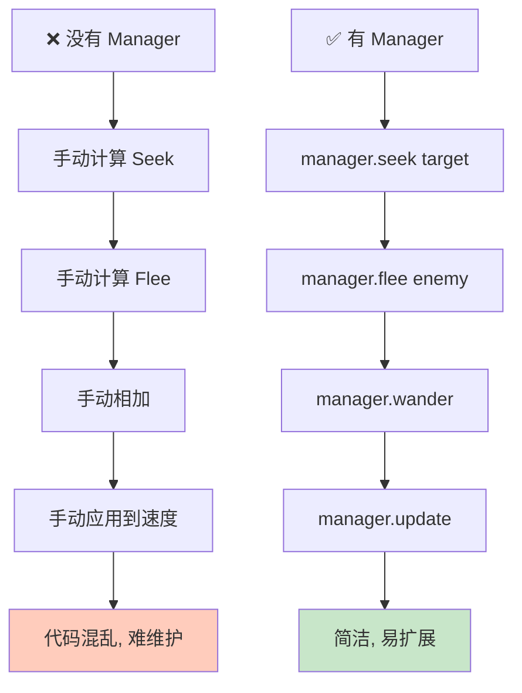
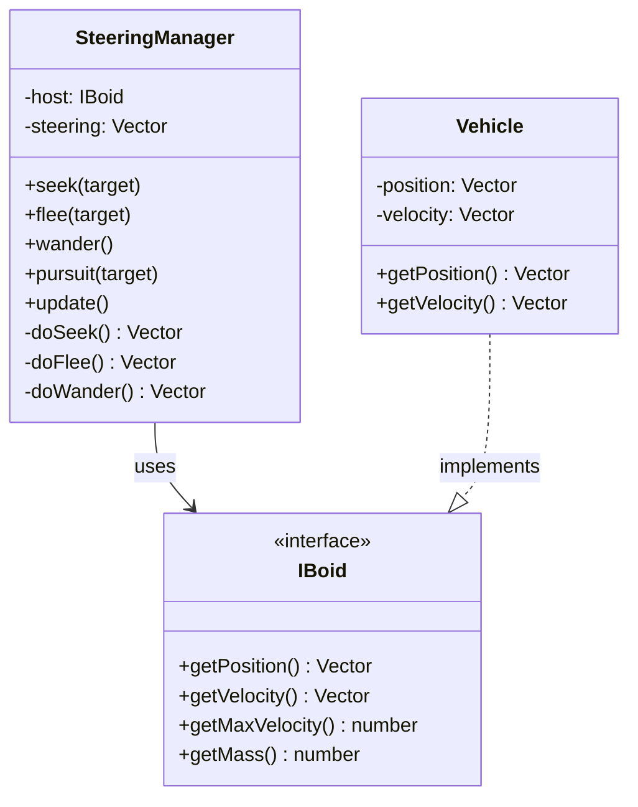
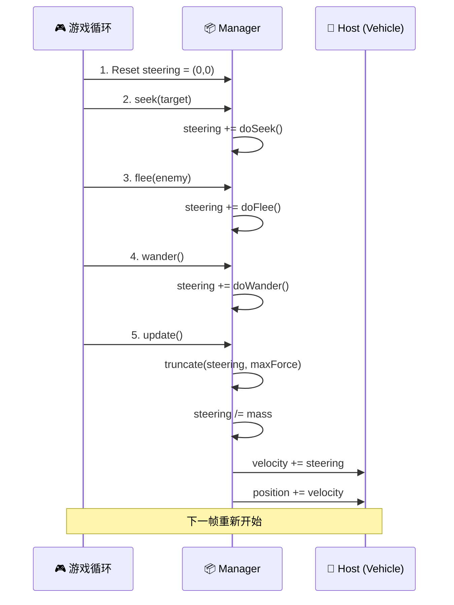

# Movement Manager (移动管理器)

## 概念总结 (Concept Overview)

> [!abstract] 核心思想
> **Movement Manager** 是一种**架构模式**，用于优雅地组合多个 Steering Behaviors。它就像一个"力的调度中心"，负责收集、累加、应用所有行为产生的力。

**为什么需要 Manager？**



---

## 架构设计 (Architecture)

### IBoid 接口

为了让 Manager 通用化，任何想使用 Steering Behaviors 的实体都应实现 `IBoid` 接口：

```typescript
interface IBoid {
    getPosition(): Vector
    getVelocity(): Vector
    getMaxVelocity(): number
    getMass(): number
}
```

> [!tip] 设计模式
> 这是**依赖倒置原则 (DIP)**：Manager 依赖抽象接口而非具体类，实现解耦。

### SteeringManager 类结构



---

## 工作流程 (Workflow)

### 每帧执行过程



### 代码示例

```javascript
// 每帧调用
function update() {
    // 调用想要的行为 (顺序无关)
    manager.seek(target);
    manager.flee(enemy);
    manager.wander();
    
    // 应用所有累积的力
    manager.update();
}
```

---

## 核心机制详解

### Public API (对外接口)

```javascript
class SteeringManager {
    seek(target, slowingRadius = 0) {
        // 累加到 steering
        this.steering.add(this.doSeek(target, slowingRadius));
    }
    
    flee(target) {
        this.steering.add(this.doFlee(target));
    }
    
    // ... 其他行为
}
```

> [!important] 累加机制
> 每次调用行为方法，返回的 Force 被**累加**到 `steering` 属性，而不是覆盖。

### Private Implementation (内部实现)

```javascript
doSeek(target, slowingRadius) {
    let desired = target.subtract(this.host.getPosition());
    let distance = desired.length();
    desired.normalize();
    
    if (distance <= slowingRadius) {
        desired.scale(this.host.getMaxVelocity() * distance / slowingRadius);
    } else {
        desired.scale(this.host.getMaxVelocity());
    }
    
    let force = desired.subtract(this.host.getVelocity());
    return force; // 返回 Force, 不直接修改 steering
}
```

### Update 方法

```javascript
update() {
    // 1. 限制总力大小
    this.steering.truncate(MAX_FORCE);
    
    // 2. 应用牛顿第二定律 F = ma, a = F/m
    this.steering.scale(1 / this.host.getMass());
    
    // 3. 更新速度
    this.host.velocity.add(this.steering);
    this.host.velocity.truncate(this.host.getMaxVelocity());
    
    // 4. 更新位置
    this.host.position.add(this.host.velocity);
    
    // 5. 重置 steering 为下一帧准备
    this.reset();
}
```

---

## 优势分析 (Benefits)

> [!success] 代码组织
> - ✅ **单一职责**: Manager 只负责力的计算和应用
> - ✅ **易于组合**: 任意叠加行为，代码简洁
> - ✅ **可测试性**: 每个行为独立测试

> [!success] 扩展性
> - ✅ **添加新行为**: 新增一对 public/private 方法即可
> - ✅ **复用**: 多个实体共享同一套行为逻辑

### 对比图

| 特性 | 手动管理 | Movement Manager |
|------|---------|-----------------|
| 代码行数 | 大量重复 | 简洁 1-2 行 |
| 可读性 | 混乱 | 清晰语义化 |
| 维护成本 | 高 | 低 |
| 扩展性 | 困难 | 容易 |

---

## 实际应用示例

### 复杂组合行为

```javascript
// 一个追逐敌人同时避障的 AI
function updateAI() {
    manager.pursuit(player);           // 追玩家
    manager.collisionAvoidance(obstacles); // 避障碍
    manager.separation(allies);        // 和队友保持距离
    manager.update();
}
```

> [!example] Flocking (群聚)
> Boids 算法就是 Management 的经典应用：
> ```javascript
> manager.separation(flock);  // 分离
> manager.alignment(flock);   // 对齐
> manager.cohesion(flock);    // 聚合
> manager.update();
> ```

---

## 最佳实践 (Best Practices)

> [!tip] 调用顺序
> - **不敏感**: Manager 的调用顺序通常不影响结果 (向量加法交换律)
> - **例外**: Queue 行为需要在最后调用 (依赖 `steering` 的值)

> [!warning] 常见错误
> - ❌ 忘记调用 `update()`
> - ❌ 在 `update()` 之后又调用行为方法
> - ❌ 多次调用 `update()` (一帧一次)

---

## 相关链接

- Previous: [[04_Pursuit_Evade|Pursuit & Evade]]
- Next: [[06_Collision_Avoidance|Collision Avoidance]]
- Related: [[08_Leader_Following|Leader Following]] (Manager 的应用典范)
- Architecture: [[demo/steering.js|Demo Implementation]]

---

## 参考资料

- [TutsPlus: Movement Manager](https://code.tutsplus.com/understanding-steering-behaviors-movement-manager--gamedev-4278t)
- Design Pattern: Strategy Pattern + Facade Pattern

^manager-pattern
