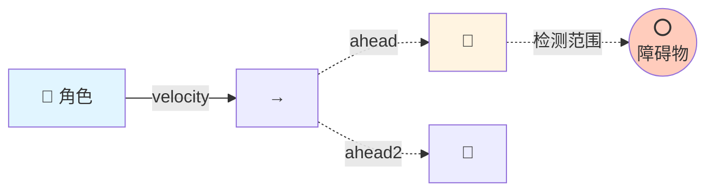
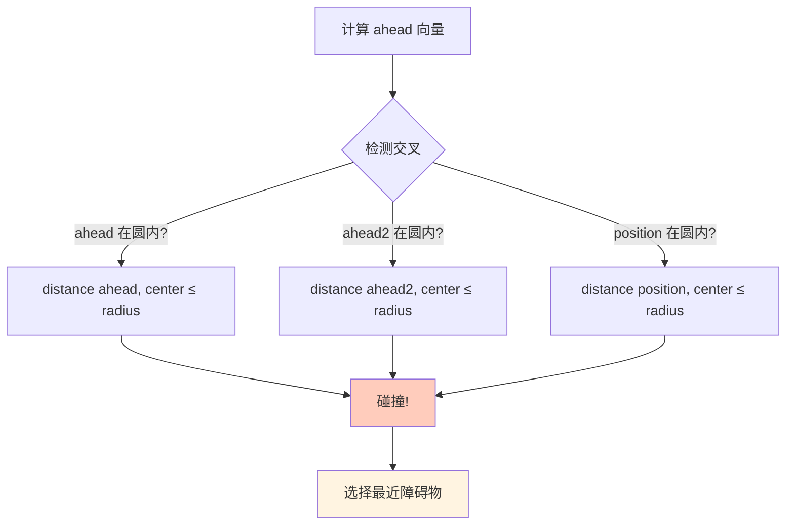
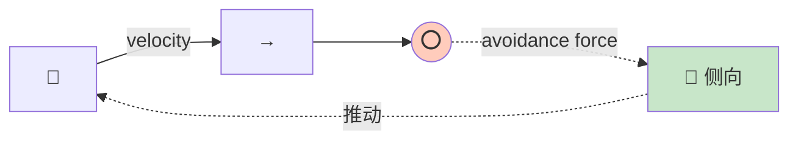
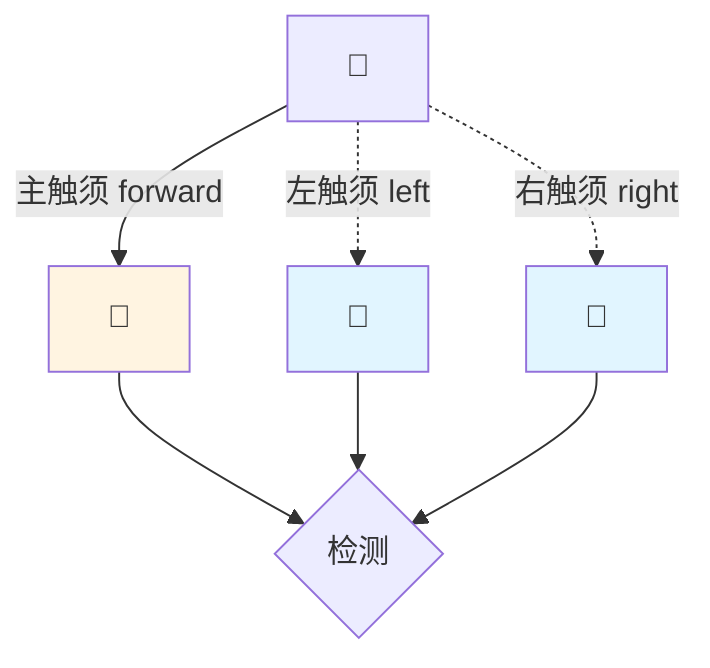
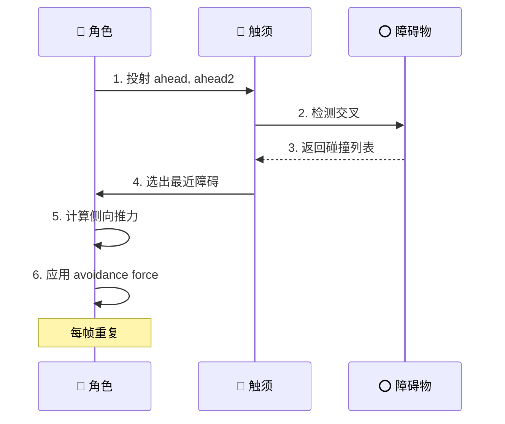

# Collision Avoidance (避障)

## 概念总结 (Concept Overview)

> [!abstract] 核心思想
> **Collision Avoidance** 通过向前投射"触须 (Feelers)"检测障碍物，一旦检测到就施加侧向推力。这是一种**局部避障**方法，不同于全局寻路 (A*)。

**适用范围:**
- ✅ **动态障碍**: 实时反应，不需要预先计算路径
- ✅ **简单场景**: 开阔空间中的若干障碍
- ❌ **复杂迷宫**: 无法处理 U 形死胡同 (需要 A*)

---

## Raycasting 检测机制

### 触须投射



### 几何检测



### 公式实现

$$
\vec{ahead} = \vec{position} + \text{normalize}(\vec{velocity}) \times d_{see}
$$

$$
\vec{ahead2} = \vec{position} + \text{normalize}(\vec{velocity}) \times \frac{d_{see}}{2}
$$

```javascript
// 计算触须
let ahead = position.clone().add(
    velocity.clone().normalize().scale(MAX_SEE_AHEAD)
);

let ahead2 = position.clone().add(
    velocity.clone().normalize().scale(MAX_SEE_AHEAD * 0.5)
);

// 检测碰撞 (简化为点-圆检测)
function lineIntersectsCircle(ahead, ahead2, obstacle) {
    return distance(ahead, obstacle.center) <= obstacle.radius ||
           distance(ahead2, obstacle.center) <= obstacle.radius;
}
```

---

## 回避力计算 (Avoidance Force)

### 力的方向

从障碍物中心指向 `ahead` 点 → 推开角色。

$$
\vec{F}_{avoid} = \frac{\vec{ahead} - \vec{center}}{|\vec{ahead} - \vec{center}|} \times F_{max}
$$

```javascript
let avoidance = new Vector(0, 0);

if (mostThreatening != null) {
    avoidance.x = ahead.x - mostThreatening.center.x;
    avoidance.y = ahead.y - mostThreatening.center.y;
    avoidance.normalize().scale(MAX_AVOID_FORCE);
}

return avoidance;
```

### 可视化



---

## 优化策略 (Optimizations)

### 动态触须长度

> [!tip] Speed-based Scaling
> 速度越快，触须越长 → 提前预警

$$
d_{dynamic} = \frac{|\vec{velocity}|}{v_{max}} \times d_{max}
$$

```javascript
let dynamic_length = velocity.length() / MAX_VELOCITY;
let ahead = position.add(velocity.normalize().scale(dynamic_length));
```

**好处：**
- 高速时：提前检测，避免撞车
- 低速/静止时：触须缩短，避免误触发

### 多触须系统



---

## 工作流程 (Workflow)



---

## 应用场景

| 场景 | 描述 | 配置建议 |
|------|------|---------|
| 🚗 **车辆导航** | 街道上避开障碍 | `MAX_SEE_AHEAD=100` |
| 🧟 **僵尸追击** | 追玩家同时避墙 | 结合 `pursuit + avoid` |
| 🐟 **水下生物** | 避开礁石 | `MAX_SEE_AHEAD=50` |
| 🚁 **无人机** | 3D 空间避障 | 需要 3D 触须 |

---

## 常见问题 (FAQ)

> [!question] 为什么需要 ahead2?
> 单一触须可能"穿过"小障碍物。`ahead2` 在中点检测，增加灵敏度。

> [!question] 如何处理多个障碍物?
> 选择**最近**的一个 (Most Threatening)，其他暂时忽略。下一帧会重新评估。

> [!question] Collision Avoidance vs Pathfinding?
> - **Avoidance**: 局部反应，快速但可能卡死角
> - **Pathfinding**: 全局规划，能走出迷宫但计算昂贵
> - **最佳实践**: Pathfinding 指引大方向，Avoidance 处理细节

---

## 相关链接

- Previous: [[05_Movement_Manager|Movement Manager]]
- Next: [[07_Path_Following|Path Following]]
- Combine with: [[01_Seek|Seek]] + [[04_Pursuit_Evade|Pursuit]]
- Advanced: [[09_Queue|Queue]] (也用到触须检测)

---

## 参考资料

- [TutsPlus: Collision Avoidance](https://code.tutsplus.com/understanding-steering-behaviors-collision-avoidance--gamedev-7777t)
- Ray-Circle Intersection: [Math Reference](https://en.wikipedia.org/wiki/Line–sphere_intersection)

^collision-detection
