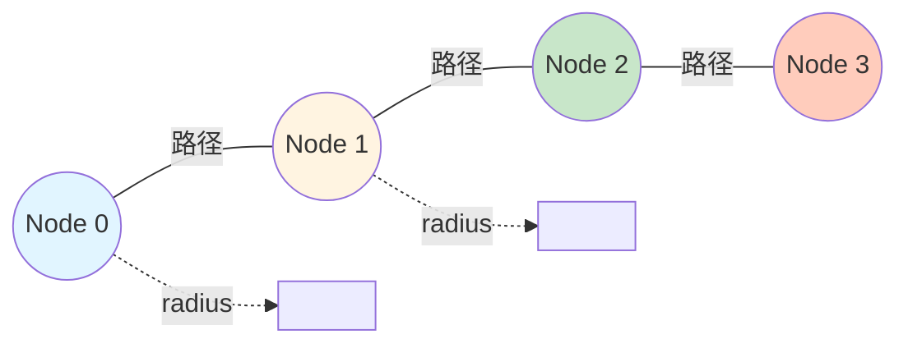
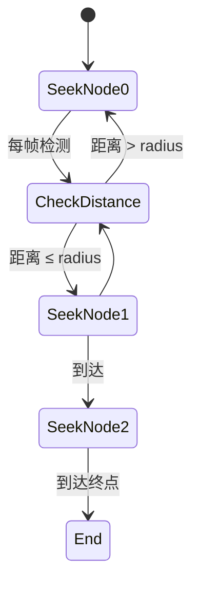
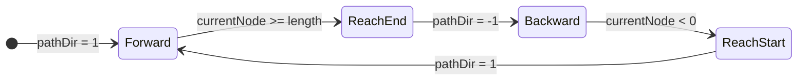

# Path Following (路径跟随)

## 概念总结 (Concept Overview)

> [!abstract] 核心思想
> **Path Following** 让角色沿着预定义的路径 (由多个节点组成) 移动。与严格的"轨道行驶"不同，Steering 版本的路径跟随允许一定偏移，更加自然灵活。

**路径类型:**
- 📍 **Waypoint Path**: 一系列点连成的折线
- 🌊 **Spline Path**: 平滑曲线 (可简化为密集的点)

---

## 路径定义 (Path Definition)

### 数据结构

```typescript
class Path {
    nodes: Vector[];      // 路径节点
    radius: number;       // 路径宽度
}
```

### 可视化



> [!tip] Radius 的作用
> `radius` 定义了路径的"宽度"。角色只要进入以节点为圆心、半径为 `radius` 的圆内，就算到达该节点。

---

## 基础跟随逻辑

### 算法流程



### 代码实现

```javascript
function pathFollowing() {
    if (!path || path.nodes.length === 0) return new Vector(0, 0);
    
    let target = path.nodes[currentNode];
    
    // 检测是否到达当前节点
    if (position.distance(target) <= path.radius) {
        currentNode++;  // 切换到下一个节点
        
        if (currentNode >= path.nodes.length) {
            currentNode = path.nodes.length - 1;  // 停在终点
        }
    }
    
    return seek(target);  // Seek 当前目标节点
}
```

---

## 平滑移动 (Smoothing)

### 问题：生硬转角

> [!warning] 精确踩点的问题
> 如果要求角色**必须**踩到节点才算到达，会导致：
> - 在节点附近打转调整
> - 转弯角度过大，不自然

### 解决：路径半径 (Path Radius)

引入 `radius` 后，角色可以"切内角"，形成自然的弧线转弯。

```mermaid
graph TD
    subgraph 无 Radius（生硬）
        A1[Node A] --> B1[精确到达A]
        B1 --> C1[急转弯]
        C1 --> D1[Node B]
    end
    
    subgraph 有 Radius（平滑）
        A2[Node A] -.radius.-> B2[提前切换]
        B2 --> C2[弧线转弯]
        C2 --> D2[Node B]
    end
    
    style C1 fill:#ffccbc
    style C2 fill:#c8e6c9
```

> [!success] 最小省力原则
> 人类走路时也会切内角，这是自然界的"最小省力原则"。`radius` 模拟了这一点。

---

## 巡逻模式 (Patrol Mode)

### Ping-Pong 往返

```javascript
class PathFollower {
    currentNode = 0;
    pathDir = 1;  // 1 = 向前, -1 = 向后
    
    pathFollowing() {
        let target = path.nodes[currentNode];
        
        if (position.distance(target) <= path.radius) {
            currentNode += pathDir;
            
            // 到达终点或起点时反向
            if (currentNode >= path.nodes.length || currentNode < 0) {
                pathDir *= -1;
                currentNode += pathDir;
            }
        }
        
        return seek(target);
    }
}
```

### 状态转换图



---

## 应用场景

> [!example] 实际用例
> - 🚂 **过山车轨道**: 固定路径循环运行
> - 🚁 **巡逻路线**: 守卫按固定路线巡逻
> - 🏎️ **赛车游戏**: AI 车辆沿赛道行驶
> - 🚶 **NPC 行走路径**: 城镇 NPC 的日常路线

---

## 高级技巧

### 1. 路径预测

角色不仅 Seek 当前节点，还可以"展望"下一个节点，提前调整方向。

```javascript
let nextNode = (currentNode + 1) % path.nodes.length;
let blend = seek(currentTarget) * 0.7 + seek(nextTarget) * 0.3;
```

### 2. 动态路径

路径节点可以在运行时移动 (例如移动平台)，角色会自动适应。

### 3. 结合其他行为

```javascript
manager.pathFollowing(path);
manager.collisionAvoidance(obstacles);  // 避障
manager.separation(allies);             // 保持间距
manager.update();
```

---

## 常见问题 (FAQ)

> [!question] Path Following vs Waypoint Navigation?
> 本质相同。Waypoint 是 Path Following 的一个具体实现。

> [!question] 如何处理动态障碍?
> Path Following 本身不处理。需结合 [[06_Collision_Avoidance|Collision Avoidance]]。

> [!question] 路径可以闭合吗?
> 可以。让 `nodes[last]` 靠近 `nodes[0]`，或在到达终点时直接 `currentNode = 0`。

---

## 相关链接

- Previous: [[06_Collision_Avoidance|Collision Avoidance]]
- Next: [[08_Leader_Following|Leader Following]]
- Compare: A* Pathfinding (全局) vs Path Following (局部)
- Combine: [[03_Wander|Wander]] + Path (沿路径随机徘徊)

---

## 参考资料

- [TutsPlus: Path Following](https://code.tutsplus.com/understanding-steering-behaviors-path-following--gamedev-8769t)
- Spline Curves: [Catmull-Rom Spline](https://en.wikipedia.org/wiki/Centripetal_Catmull–Rom_spline)

^path-following
