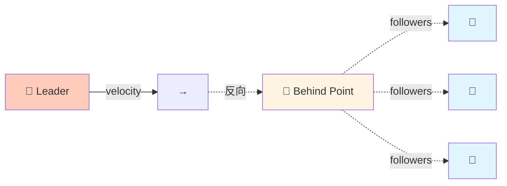
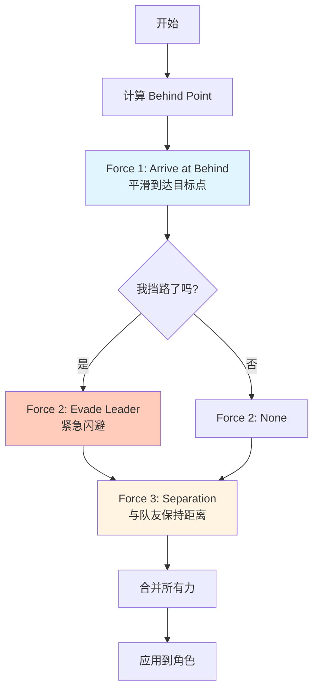
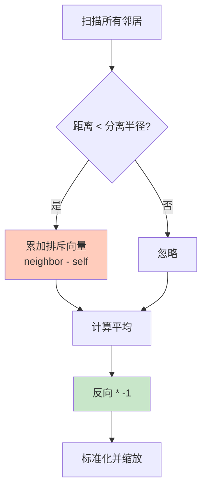
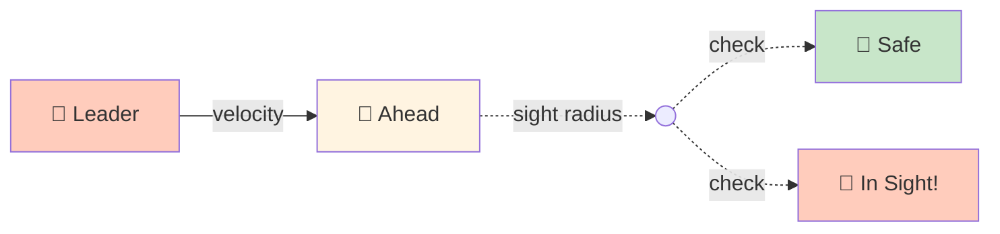
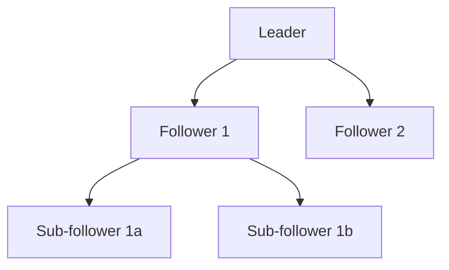

# Leader Following (领袖跟随)

## 概念总结 (Concept Overview)

> [!abstract] 核心思想
> **Leader Following** 是一种**组合行为**，让一群角色以队形跟随领袖。它结合了 **Arrival**, **Separation**, 和 **Evade** 三个基础行为。

**行为拆解:**
- 🎯 **Arrival**: 跟随领袖身后的 "Behind Point"
- 🚫 **Separation**: 与其他跟随者保持距离
- ⚡ **Evade**: 如果挡住领袖的路，立即闪开

---

## Behind Point 计算

### 概念图



### 公式推导

$$
\vec{behind} = \vec{pos}_{leader} + (-\vec{v}_{leader}) \times d_{behind}
$$

```javascript
// 1. 获取领袖速度的反向
let tv = leader.velocity.clone().scale(-1);

// 2. 标准化并缩放到指定距离
tv.normalize().scale(LEADER_BEHIND_DIST);

// 3. 计算 behind 点坐标
let behind = leader.position.clone().add(tv);
```

> [!tip] LEADER_BEHIND_DIST
> 这个参数控制队伍的"纵深"。越大，跟随者离领袖越远。

---

## 三力合成 (Force Composition)

### 力的组合策略



### 代码实现

```javascript
function followLeader(leader, followers) {
    // 1. 计算 Behind Point
    let tv = leader.velocity.clone().scale(-1);
    tv.normalize().scale(LEADER_BEHIND_DIST);
    let behind = leader.position.clone().add(tv);
    
    // 2. Arrive at Behind
    let force = arrive(behind, 50);  // 50 是减速半径
    
    // 3. Check if in leader's sight
    let ahead = leader.position.clone().add(
        leader.velocity.clone().normalize().scale(LEADER_BEHIND_DIST)
    );
    
    if (ahead.distance(this.position) <= LEADER_SIGHT_RADIUS) {
        // 挡路了! 紧急闪避
        force.add(evade(leader).scale(2));  // 加权
    }
    
    // 4. Separation from followers
    force.add(separation(followers));
    
    return force;
}
```

---

## Separation (分离力)

### 算法详解



$$
\vec{F}_{sep} = -\frac{1}{N} \sum_{i=1}^{N} (\vec{pos}_i - \vec{pos}_{self})
$$

```javascript
function separation(neighbors) {
    let force = new Vector(0, 0);
    let count = 0;
    
    for (let n of neighbors) {
        if (n != this && this.distance(n) <= SEP_RADIUS) {
            force.x += n.position.x - this.position.x;
            force.y += n.position.y - this.position.y;
            count++;
        }
    }
    
    if (count > 0) {
        force.scale(1 / count);   // 平均
        force.scale(-1);          // 反向 (推开)
        force.normalize().scale(MAX_SEP_FORCE);
    }
    
    return force;
}
```

---

## Leader Sight 检测

### 几何判定



```javascript
function isOnLeaderSight(leader) {
    let ahead = leader.position.clone().add(
        leader.velocity.clone().normalize().scale(LEADER_SIGHT_DIST)
    );
    
    return ahead.distance(this.position) <= SIGHT_RADIUS ||
           leader.position.distance(this.position) <= SIGHT_RADIUS;
}
```

---

## 参数调优

| 参数 | 作用 | 推荐值 | 效果 |
|------|------|--------|------|
| **LEADER_BEHIND_DIST** | 队伍纵深 | 40-80 | 越大队伍越长 |
| **LEADER_SIGHT_RADIUS** | 让路触发距离 | 20-40 | 越小越容易挡路 |
| **SEP_RADIUS** | 分离半径 | 25-50 | 越大间距越宽 |
| **Arrive Radius** | 减速区 | 50-100 | 越大越平滑 |

---

## 应用场景

> [!example] 实际用例
> - 🎖️ **战术小队**: 士兵跟随指挥官
> - 🚶 **NPC 护送任务**: NPC 跟随玩家
> - 🐦 **鸟群迁徙**: 领头鸟带领族群
> - 🚗 **车队行驶**: 车辆保持队形

---

## 高级扩展

### 1. 多层次队形



### 2. 动态队形

根据地形切换队形 (列队 → 楔形 → 环形)。

### 3. 权重调节

```javascript
force = arrive(behind) * 0.7 + 
        evade(leader) * 0.2 + 
        separation(followers) * 0.1;
```

---

## 常见问题 (FAQ)

> [!question] 跟随者会撞到一起吗?
> 不会，`separation` 力会推开它们。但如果 `SEP_RADIUS` 太小或 `MAX_SEP_FORCE` 太弱，可能挤在一起。

> [!question] 领袖突然掉头怎么办?
> `Evade` 检测会触发，跟随者会紧急闪避。

> [!question] 如何让队形更紧密?
> 减小 `LEADER_BEHIND_DIST` 和 `SEP_RADIUS`。

---

## 相关链接

- Previous: [[07_Path_Following|Path Following]]
- Next: [[09_Queue|Queue]]
- Related: Flocking (Boids) - 三力组合的另一经典应用
- Components: [[02_Flee_Arrival|Arrival]], [[04_Pursuit_Evade|Evade]]

---

## 参考资料

- [TutsPlus: Leader Following](https://code.tutsplus.com/understanding-steering-behaviors-leader-following--gamedev-10810t)
- Reynolds Boids: [Separation, Alignment, Cohesion](https://www.red3d.com/cwr/boids/)

^leader-following
