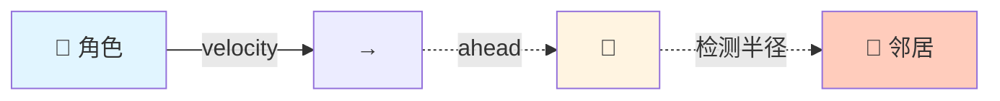
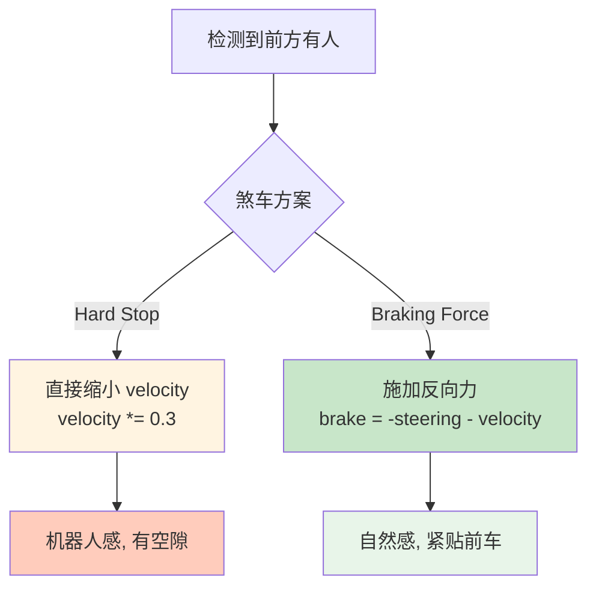
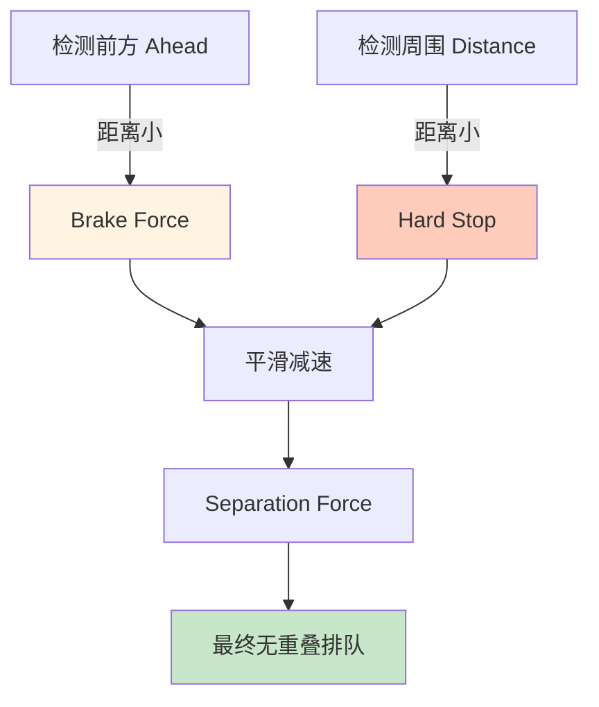
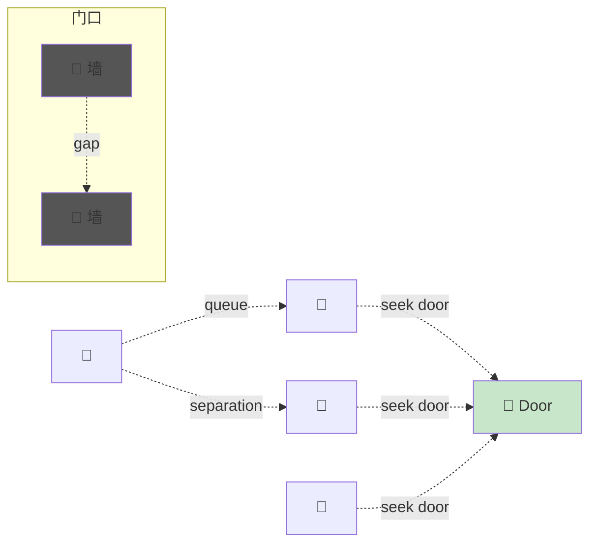

# Queue (排队) 行为

## 概念总结 (Concept Overview)

> [!abstract] 核心思想
> **Queue** 行为让角色在拥挤的通道 (如门口) 自动排队，避免堆叠和混乱。它通过检测前方邻居并**煞车 (Braking)** + **分离 (Separation)** 来实现文明排队。

**应用场景:**
- 🚪 **门口疏散**: 人群有序通过狭窄通道
- 🏪 **收银台排队**: 顾客依次结账
- 🚗 **交通拥堵**: 车辆在瓶颈处排队
- 🎢 **游乐设施**: 游客排队等候

---

## 检测前方邻居 (Neighbor Ahead Detection)

### 触须投射

与 [[06_Collision_Avoidance|Collision Avoidance]] 类似，Queue 也使用前方触须检测。



### 代码实现

```javascript
function getNeighborAhead() {
    let qa = velocity.clone().normalize().scale(MAX_QUEUE_AHEAD);
    let ahead = position.clone().add(qa);
    
    for (let neighbor of allAgents) {
        if (neighbor != this && 
            ahead.distance(neighbor.position) <= MAX_QUEUE_RADIUS) {
            return neighbor;  // 找到第一个就返回
        }
    }
    
    return null;  // 前方无人
}
```

---

## 煞车机制 (Braking Mechanism)

### 方案对比



### Hard Stop (简单粗暴)

```javascript
function queue_hardStop() {
    let neighbor = getNeighborAhead();
    
    if (neighbor != null) {
        velocity.scale(0.3);  // 缩小到 30%
    }
    
    return new Vector(0, 0);  // 不产生额外力
}
```

> [!tip] 工作原理
> 反复缩小速度 → 速度趋近于 0 → 停止。
> 当前方邻居移开后，速度会逐渐恢复。

### Braking Force (平滑制动)

```javascript
function queue_brake() {
    let neighbor = getNeighborAhead();
    let brake = new Vector(0, 0);
    
    if (neighbor != null) {
        // 1. 抵消 80% 的当前 steering
        brake.x = -this.steering.x * 0.8;
        brake.y = -this.steering.y * 0.8;
        
        // 2. 抵消当前 velocity
        let v = velocity.clone().scale(-1);
        brake.add(v);
        
        // 3. 加入 separation 防止重叠
        brake.add(separation(allAgents));
    }
    
    return brake;
}
```

> [!important] 关键点
> - **Brake Force** 必须在**所有其他行为之后**调用，因为它依赖 `steering` 的累积值
> - `brake = -steering * 0.8 - velocity` 会逐步抵消所有推进力

---

## 力的流程图 (Force Workflow)

```mermaid
sequenceDiagram
    participant Loop as 游戏循环
    participant Mgr as Manager
    participant Queue as Queue Behavior
    
    Loop->>Mgr: 1. manager.seek(door)
    Mgr->>Mgr: steering += seek_force
    Loop->>Mgr: 2. manager.collisionAvoidance()
    Mgr->>Mgr: steering += avoid_force
    Loop->>Mgr: 3. manager.queue()
    Queue->>Queue: 检测前方邻居
    Queue->>Queue: 计算 brake = -steering - velocity
    Mgr->>Mgr: steering += brake
    Loop->>Mgr: 4. manager.update()
    Mgr->>Mgr: 应用总力到速度和位置
    
    Note over Queue: Queue 必须最后调用!
```

---

## 防止重叠 (Overlap Prevention)

### 双重检测



### 组合代码

```javascript
function queue_combined() {
    let neighbor = getNeighborAhead();
    let brake = new Vector(0, 0);
    
    if (neighbor != null) {
        // 1. Braking Force
        brake.x = -this.steering.x * 0.8;
        brake.y = -this.steering.y * 0.8;
        brake.add(velocity.clone().scale(-1));
        
        // 2. Hard Stop (如果太近)
        if (position.distance(neighbor.position) <= MAX_QUEUE_RADIUS) {
            velocity.scale(0.3);
        }
        
        // 3. Separation
        brake.add(separation(allAgents));
    }
    
    return brake;
}
```

---

## 场景示例: 门口疏散

### 设置



### 行为组合

```javascript
function updateCrowdAgent() {
    manager.seek(doorwayPosition);        // 目标: 门口
    manager.collisionAvoidance(walls);    // 避开墙壁
    manager.queue(allAgents);             // 排队
    manager.update();
}
```

---

## 参数调优

| 参数 | 作用 | 推荐值 | 效果 |
|------|------|--------|------|
| **MAX_QUEUE_AHEAD** | 触须长度 | 40-60 | 越长越提前煞车 |
| **MAX_QUEUE_RADIUS** | 检测半径 | 15-25 | 越大间距越宽 |
| **Brake Factor** | 煞车力度 | 0.7-0.9 | 越大煞得越急 |
| **Separation Radius** | 分离半径 | 20-30 | 防重叠距离 |

---

## 常见问题 (FAQ)

> [!question] 为什么 Queue 要最后调用?
> 因为 Braking Force 需要读取 `steering` 的累积值。如果先调用 Queue，`steering` 还是空的。

> [!question] Hard Stop vs Braking Force 哪个好?
> - **Hard Stop**: 简单，但会留空隙
> - **Braking Force**: 复杂，但更自然紧凑
> - **推荐**: 组合使用

> [!question] Queue 能处理多条队列吗?
> 可以。只要每个角色独立检测前方邻居即可，会自然形成多条队列。

---

## 相关链接

- Previous: [[08_Leader_Following|Leader Following]]
- Components: [[02_Flee_Arrival|Arrival]], [[05_Movement_Manager|Manager]]
- Similar: [[06_Collision_Avoidance|Collision Avoidance]] (同样用触须)
- Advanced: Traffic Simulation, Crowd Evacuation

---

## 参考资料

- [TutsPlus: Queue](https://code.tutsplus.com/understanding-steering-behaviors-queue--gamedev-14365t)
- Crowd Simulation: [Social Force Model](https://en.wikipedia.org/wiki/Social_force_model)

^queue-behavior
