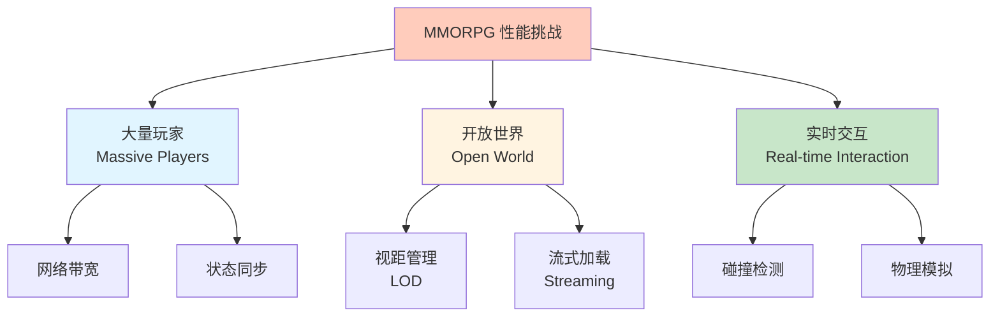
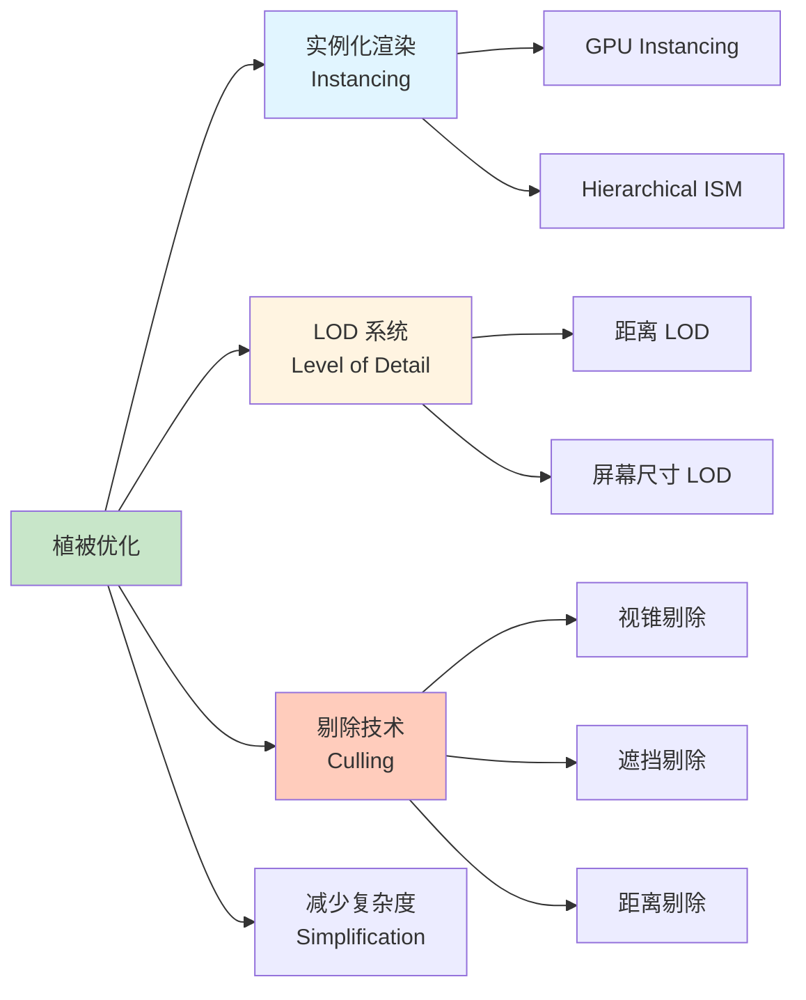
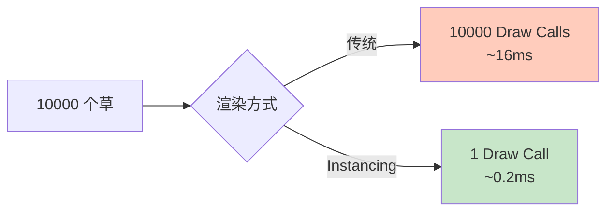
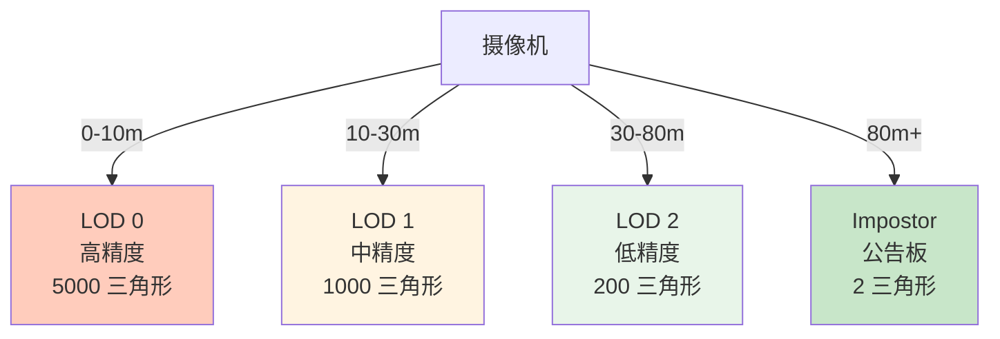
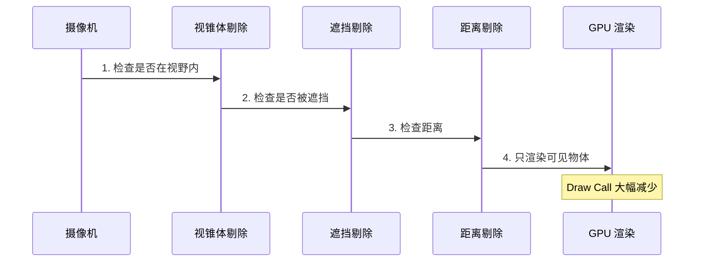
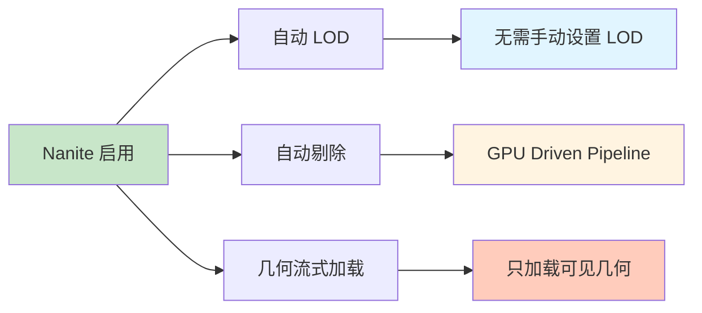
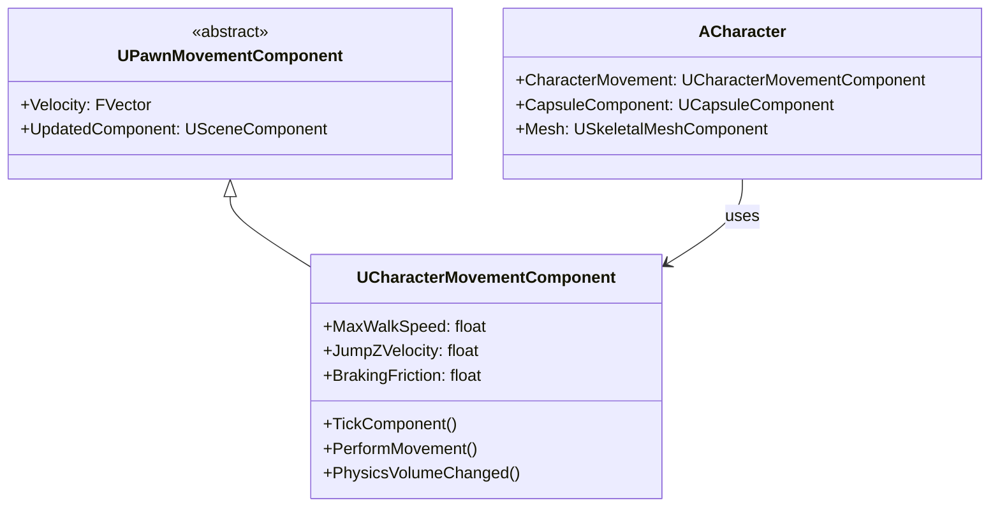
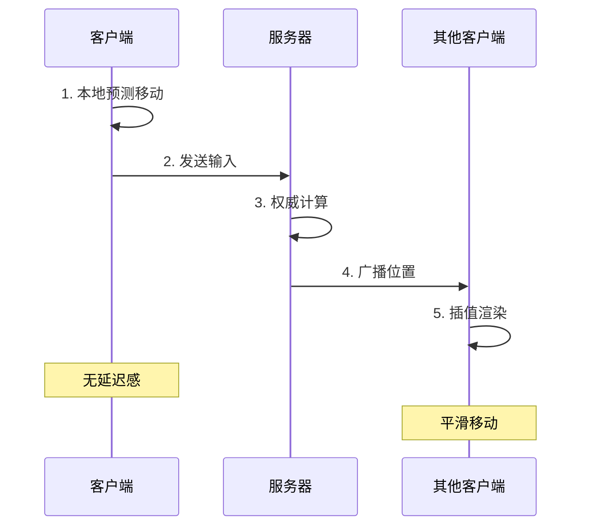
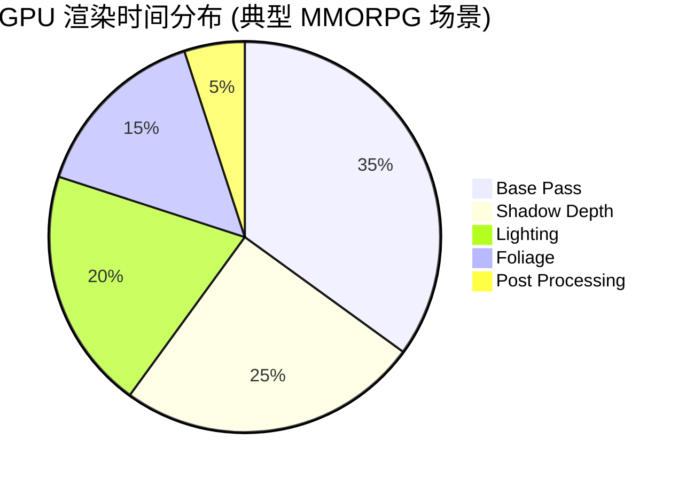
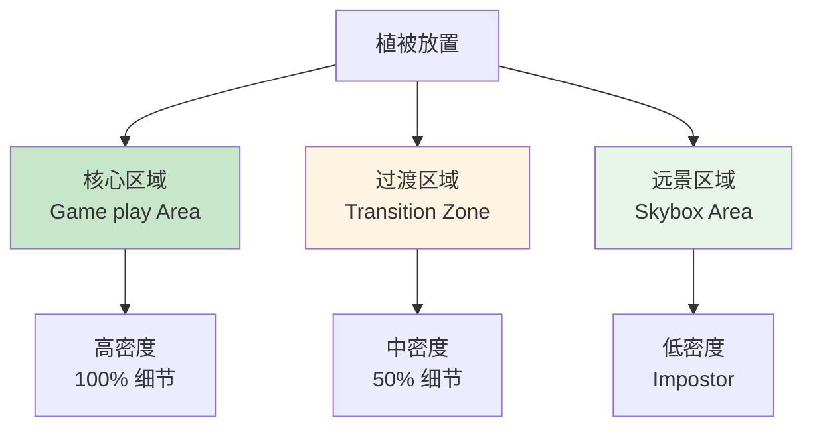

# 🎮 UE MMORPG 开发：植被与移动优化

> [!abstract] 视频概述
> 本视频是独立开发 Unreal Engine MMORPG 系列的第二集，重点关注 **GPU 负载优化**，特别是植被渲染和角色移动系统的性能优化技术。

---

## 📋 目录

- [[#核心优化目标]]
- [[#植被系统优化]]
- [[#移动系统优化]]
- [[#GPU 性能分析]]
- [[#实战技巧]]

---

## 核心优化目标 (Optimization Goals)

### MMORPG 特殊挑战



> [!important] GPU vs CPU 平衡
> MMORPG 通常是 **CPU-bound** (大量逻辑计算)，但植被渲染会导致 **GPU 瓶颈**。需要在两者之间找到平衡。

### 性能指标

| 指标 | 目标值 | 重要性 |
|------|--------|--------|
| **帧率** | 60 FPS (主流) | ⭐⭐⭐⭐⭐ |
| **渲染线程** | < 16ms | ⭐⭐⭐⭐ |
| **游戏线程** | < 16ms | ⭐⭐⭐⭐⭐ |
| **GPU 占用** | < 80% | ⭐⭐⭐⭐ |
| **内存** | < 8GB | ⭐⭐⭐ |

---

## 植被系统优化 (Vegetation Optimization)

### 问题分析

> [!danger] GPU 杀手
> **植被 (Foliage)** 是开放世界游戏中最耗 GPU 的元素之一：
> - 数百万个草叶/树木实例
> - 每帧都需要渲染
> - 风吹动画、阴影计算

### 优化策略架构



### 1. GPU Instancing (实例化渲染)

> [!tip] 核心原理
> **一次 Draw Call 渲染成千上万个相同模型**，而非每个模型一次 Draw Call。

**传统渲染 vs Instancing**:

```cpp
// ❌ 传统方式 - 10000 个草需要 10000 次 Draw Call
for (int i = 0; i < 10000; i++) {
    DrawMesh(GrassMesh, Transforms[i]);
}

// ✅ GPU Instancing - 1 次 Draw Call
DrawMeshInstanced(GrassMesh, Transforms, 10000);
```

**性能对比**:



**UE 实现**:

```cpp
// 在 Unreal Engine 中使用 Hierarchical Instanced Static Mesh
UHierarchicalInstancedStaticMeshComponent* HISM = CreateDefaultSubobject<UHierarchicalInstancedStaticMeshComponent>(TEXT("Foliage"));

// 设置静态网格
HISM->SetStaticMesh(GrassMesh);

// 批量添加实例
for (const FTransform& Transform : FoliageTransforms) {
    HISM->AddInstance(Transform);
}

// 启用 GPU Culling
HISM->bUseGPUHierarchy = true;
```

### 2. LOD 系统 (Level of Detail)

**距离 LOD 策略**:



**LOD 配置示例**:

```cpp
// 在模型导入时设置 LOD
FStaticMeshLODSettings LODSettings;

// LOD 0: 原始模型
LODSettings.LODGroups[0].ScreenSize = 1.0f;

// LOD 1: 50% 三角形
LODSettings.LODGroups[1].ScreenSize = 0.5f;
LODSettings.LODGroups[1].ReductionSettings.PercentTriangles = 0.5f;

// LOD 2: 10% 三角形
LODSettings.LODGroups[2].ScreenSize = 0.15f;
LODSettings.LODGroups[2].ReductionSettings.PercentTriangles = 0.1f;
```

### 3. 剔除技术 (Culling)



**距离剔除配置**:

```cpp
// 植被距离剔除设置
HISM->InstanceStartCullDistance = 0;      // 开始淡出距离
HISM->InstanceEndCullDistance = 8000;     // 完全剔除距离 (80m)
HISM->bEnableDensityScaling = true;       // 根据距离降低密度
```

### 4. Nanite 虚拟几何 (UE5)

> [!success] UE5 黑科技
> **Nanite** 自动处理 LOD 和剔除，理论上支持无限数量的三角形。



---

## 移动系统优化 (Movement Optimization)

### Character Movement Component 分析



### 优化技巧

#### 1. 降低 Tick 频率

```cpp
// ❌ 每帧更新所有远处玩家 (浪费)
void AMyCharacter::Tick(float DeltaTime) {
    Super::Tick(DeltaTime);
    // 复杂的移动逻辑
}

// ✅ 根据距离动态调整 Tick 频率
void AMyCharacter::BeginPlay() {
    Super::BeginPlay();
    
    // 设置 Tick 间隔
    if (GetDistanceToPlayer() > 5000.0f) {
        SetActorTickInterval(0.1f);  // 10 FPS
    } else if (GetDistanceToPlayer() > 2000.0f) {
        SetActorTickInterval(0.033f); // 30 FPS
    } else {
        SetActorTickInterval(0.0f);   // 原生帧率
    }
}
```

#### 2. 网络更新频率优化

```cpp
// 在 Character 构造函数中
AMyMMOCharacter::AMyMMOCharacter() {
    // 默认网络更新频率
    NetUpdateFrequency = 10.0f;  // 每秒 10 次
    MinNetUpdateFrequency = 2.0f; // 最低 2 次/秒
    
    // 根据重要性动态调整
    NetPriority = 1.0f;
}

// 动态调整更新频率
void AMyMMOCharacter::UpdateNetworkPriority() {
    float Distance = GetDistanceToLocalPlayer();
    
    if (Distance < 1000.0f) {
        NetUpdateFrequency = 30.0f;  // 近距离高频更新
    } else if (Distance < 5000.0f) {
        NetUpdateFrequency = 10.0f;  // 中距离正常更新
    } else {
        NetUpdateFrequency = 2.0f;   // 远距离低频更新
    }
}
```

#### 3. Movement Component 优化

```cpp
// 禁用不需要的功能
CharacterMovement->bUseRVOAvoidance = false;          // 如果不需要 AI 避障
CharacterMovement->bRequestedMoveUseAcceleration = true; // 使用加速度而非瞬时速度
CharacterMovement->GroundFriction = 8.0f;             // 提高摩擦力让停止更快
```

### 移动预测与插值



---

## GPU 性能分析 (GPU Profiling)

### UE Profiling 工具

> [!tip] 常用命令
> ```
> stat GPU          - GPU 性能统计
> stat FPS          - 帧率显示
> stat Unit         - CPU/GPU 时间
> profileGPU        - 详细 GPU 分析
> r.ScreenPercentage - 动态分辨率调整
> ```

### GPU 时间分布



### 优化检查清单

> [!example] 性能优化 Checklist
> - [ ] **植被**: 使用 HISM 而非单独 Actor
> - [ ] **LOD**: 所有模型都有至少 3 级 LOD
> - [ ] **材质**: Shader 复杂度 < 100 instructions
> - [ ] **光照**: 使用烘焙光照，动态光源 < 3 个
> - [ ] **阴影**: 级联阴影距离 < 5000 单位
> - [ ] **后处理**: 禁用不必要的效果 (景深、运动模糊)
> - [ ] **网络**: 远距离角色降低更新频率
> - [ ] **碰撞**: 使用简化碰撞体

---

## 实战技巧 (Practical Tips)

### 植被放置策略



### 性能预算分配

| 系统 | GPU 预算 | CPU 预算 | 优先级 |
|------|---------|---------|--------|
| **核心玩法** | 30% | 40% | 最高 |
| **植被渲染** | 25% | 5% | 高 |
| **角色/NPC** | 20% | 30% | 高 |
| **光照/阴影** | 15% | 10% | 中 |
| **特效** | 10% | 15% | 低 |

### 动态性能调整

```cpp
// 根据帧率动态调整画质
void UMyGameSettings::DynamicQualityAdjustment() {
    static float FrameTimeHistory[60];
    static int HistoryIndex = 0;
    
    // 记录帧时间
    FrameTimeHistory[HistoryIndex] = FApp::GetDeltaTime();
    HistoryIndex = (HistoryIndex + 1) % 60;
    
    // 计算平均帧时间
    float AvgFrameTime = 0;
    for (float Time : FrameTimeHistory) {
        AvgFrameTime += Time;
    }
    AvgFrameTime /= 60.0f;
    
    // 动态调整
    if (AvgFrameTime > 0.02f) {  // < 50 FPS
        // 降低设置
        GEngine->GetGameUserSettings()->SetFoliageDensity(0.5f);
        GEngine->GetGameUserSettings()->SetShadowQuality(1);
    } else if (AvgFrameTime < 0.013f) {  // > 75 FPS
        // 提升设置
        GEngine->GetGameUserSettings()->SetFoliageDensity(1.0f);
        GEngine->GetGameUserSettings()->SetShadowQuality(3);
    }
}
```

---

## 📚 扩展阅读

- [[UE性能优化|Unreal Engine Performance Optimization]]
- [[大型多人游戏架构|MMORPG Architecture Design]]
- [[GPU渲染管线|GPU Rendering Pipeline]]

---

## 🔗 相关资源

- UE 官方文档: [Performance Guidelines](https://docs.unrealengine.com/performance-guidelines/)
- GDC Talk: "Optimizing Open World Games"
- 开源项目: [Lyra Sample Project](https://www.unrealengine.com/marketplace/en-US/product/lyra)

---

## 💡 学习反思

> [!note] 关键收获
> 1. **GPU Instancing** 是大规模植被渲染的基础
> 2. **LOD + Culling** 组合拳减少 80% 渲染负担
> 3. **网络优化**与渲染优化同样重要
> 4. **分析工具**是优化的第一步，盲目优化事倍功半

> [!question] 待深入研究
> - [ ] Nanite 在植被上的实际效果
> - [ ] 服务端如何处理数千玩家的移动同步
> - [ ] World Partition 的流式加载细节
> - [ ] 移动端 MMORPG 的优化策略差异

> [!warning] 常见陷阱
> - ❌ 过度优化：不要为了 1ms 牺牲代码可读性
> - ❌ 过早优化：先实现功能，再根据分析结果优化
> - ❌ 忽视工具：手动优化不如用 UE 内置的自动优化工具

---

#unreal-engine #mmorpg #optimization #gpu #indie-gamedev

^ue-mmorpg-optimization
