# 🚀 Rocket League 物理系统详解

> [!abstract] 视频概述
> 本笔记基于技术讲解视频 "It IS Rocket Science! The Physics of Rocket League Detailed"，深入分析火箭联盟游戏中的物理引擎实现、网络同步机制以及游戏性设计。

---

## 📋 目录

- [[#核心物理系统]]
- [[#车辆动力学]]
- [[#球体物理]]
- [[#碰撞检测]]
- [[#网络同步机制]]
- [[#性能优化]]

---

## 核心物理系统 (Core Physics System)

### 游戏引擎架构

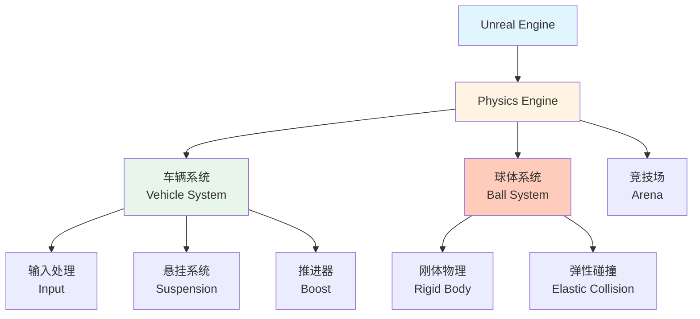

> [!tip] 引擎选择
> Rocket League 使用 **Unreal Engine 3** (后续版本升级到 UE4/UE5)，内置的 **PhysX** 物理引擎提供了基础的刚体动力学支持。

### 物理更新循环

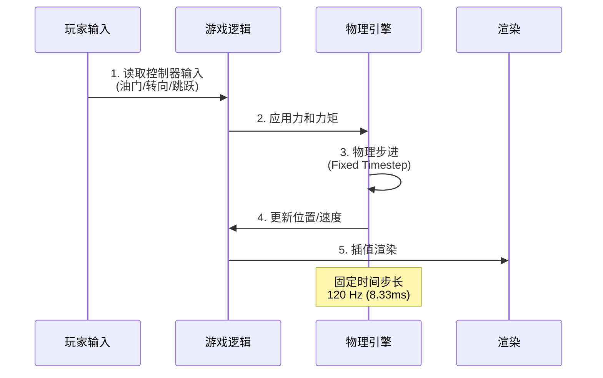

> [!important] 固定时间步长
> **关键设计**: 物理模拟使用 **120Hz** 的固定更新频率，确保不同帧率下的一致性。
> - **物理更新**: 120 FPS (8.33ms per frame)
> - **渲染更新**: 可变 (30-240+ FPS)
> - **插值**: 平滑渲染帧之间的运动

---

## 车辆动力学 (Vehicle Dynamics)

### 输入系统

| 控制 | 输入轴 | 物理效果 |
|------|--------|---------|
| **油门** (Throttle) | 前进/后退 | 驱动力矩 (Drive Torque) |
| **转向** (Steering) | 左/右 | 前轮转角 + 偏航力矩 |
| **跳跃** (Jump) | 按键 | 瞬时冲量 (Impulse) |
| **翻滚** (Air Roll) | 空中旋转 | 角动量 (Angular Momentum) |
| **推进器** (Boost) | 加速 | 恒定推力 (Constant Thrust) |

### 悬挂系统 (Suspension)

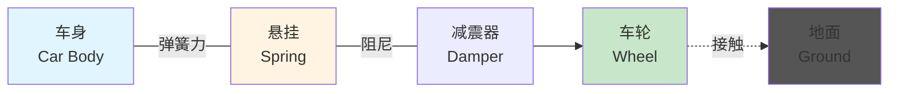

**胡克定律 (Hooke's Law)**:

$$
F_{spring} = -k \cdot \Delta x - c \cdot v
$$

$$
\begin{align}
k &= \text{弹簧刚度系数 (Spring Stiffness)} \\
\Delta x &= \text{压缩距离 (Compression Distance)} \\
c &= \text{阻尼系数 (Damping Coefficient)} \\
v &= \text{压缩速度 (Compression Velocity)}
\end{align}
$$

```javascript
// 伪代码示例
function calculateSuspensionForce(wheel) {
    let compression = wheel.restLength - wheel.currentLength;
    let compressionVelocity = wheel.getCompressionRate();
    
    let springForce = springStiffness * compression;
    let damperForce = damperCoefficient * compressionVelocity;
    
    return springForce + damperForce;
}
```

> [!example] 参数调优
> - **弹簧刚度**: 控制车辆"软硬"感
> - **阻尼系数**: 控制弹跳的衰减速度
> - **RL 特点**: 较硬的悬挂 + 高阻尼 = 响应迅速且稳定

---

## 球体物理 (Ball Physics)

### 刚体属性

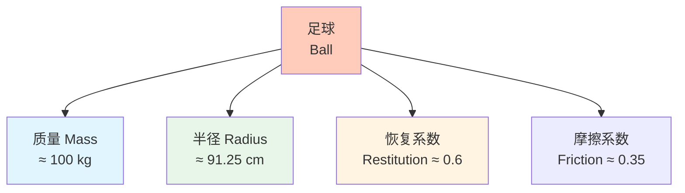

### 碰撞模型

**弹性碰撞公式**:

$$
v'_1 = \frac{(m_1 - e \cdot m_2)v_1 + (1 + e)m_2 v_2}{m_1 + m_2}
$$

$$
v'_2 = \frac{(m_2 - e \cdot m_1)v_2 + (1 + e)m_1 v_1}{m_1 + m_2}
$$

$$
\begin{align}
e &= \text{恢复系数 (Coefficient of Restitution)} \\
m_i &= \text{质量} \\
v_i &= \text{碰撞前速度} \\
v'_i &= \text{碰撞后速度}
\end{align}
$$

> [!tip] 恢复系数
> - **e = 0**: 完全非弹性碰撞 (粘在一起)
> - **e = 1**: 完全弹性碰撞 (动能守恒)
> - **RL 球体**: e ≈ 0.6 (部分能量损失)

### 旋转与马格努斯效应

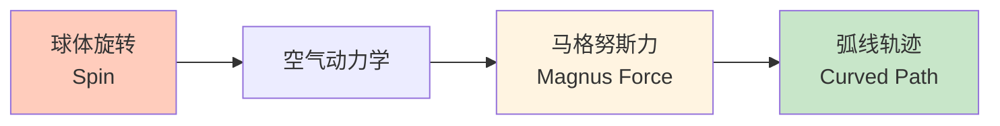

$$
\vec{F}_{magnus} = S \cdot (\vec{\omega} \times \vec{v})
$$

$$
\begin{align}
S &= \text{马格努斯系数} \\
\vec{\omega} &= \text{角速度向量} \\
\vec{v} &= \text{线速度向量}
\end{align}
$$

> [!question] RL 中是否实现？
> Rocket League **简化了空气动力学**，马格努斯效应不明显，主要依赖碰撞和推进器控制。

---

## 碰撞检测 (Collision Detection)

### 几何简化

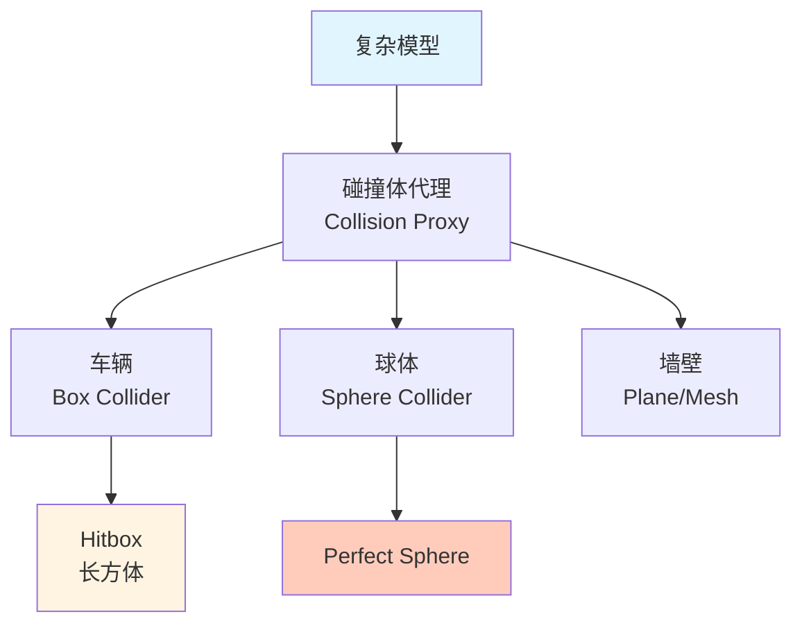

> [!important] Hitbox 设计
> - **车辆 Hitbox**: 长方体，不同车型有微小差异
> - **球体**: 完美球形，无论视觉模型如何
> - **性能考虑**: 简化几何 → 快速碰撞检测

### 碰撞响应流程

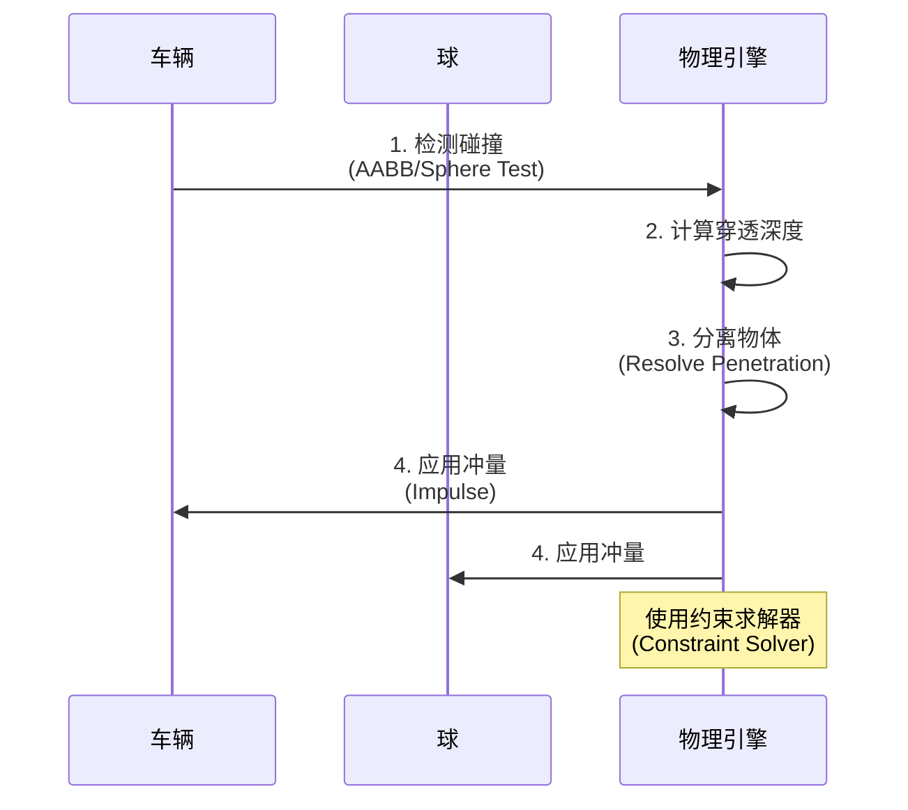

---

## 网络同步机制 (Network Synchronization)

### 客户端-服务器架构

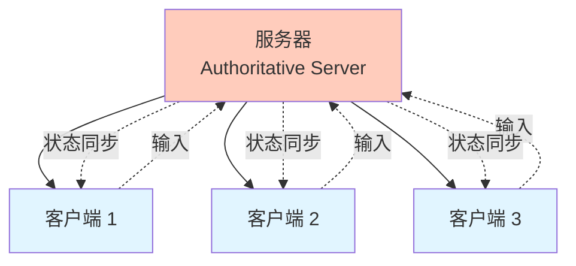

> [!success] 服务器权威
> **Server-Authoritative Model**: 服务器是物理模拟的唯一真实来源，客户端仅做预测和插值。

### 客户端预测 (Client-Side Prediction)

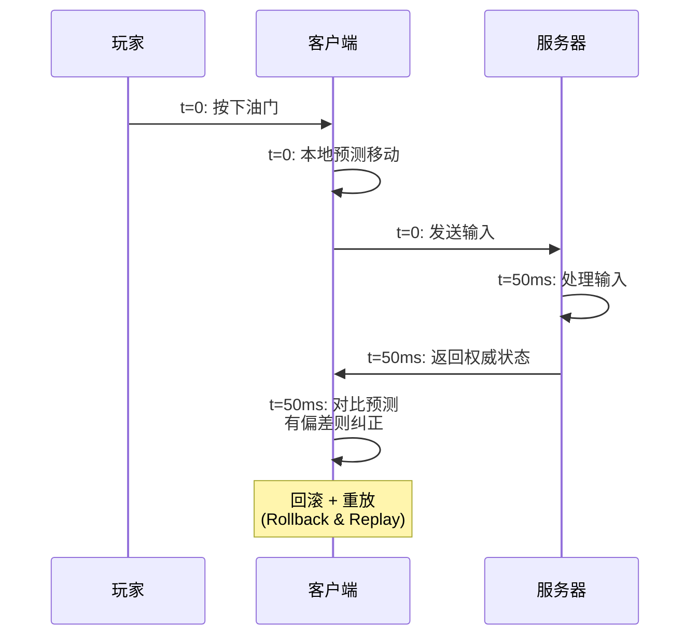

**核心机制**:

1. **输入缓冲**: 客户端存储所有未确认的输入
2. **状态快照**: 保存每一帧的世界状态
3. **服务器确认**: 收到权威状态后对比
4. **误差纠正**: 如果偏差 > 阈值，回滚并重放

```javascript
// 伪代码
class ClientPrediction {
    inputBuffer = [];
    stateSnapshots = [];
    
    onInput(input) {
        // 1. 本地预测
        this.simulatePhysics(input);
        
        // 2. 保存快照
        this.stateSnapshots.push(this.getState());
        
        // 3. 发送到服务器
        this.sendToServer(input);
        
        // 4. 缓冲输入
        this.inputBuffer.push(input);
    }
    
    onServerUpdate(serverState) {
        // 对比本地快照
        let localState = this.stateSnapshots[serverState.frameId];
        
        if (this.hasMismatch(localState, serverState)) {
            // 回滚到服务器状态
            this.setState(serverState);
            
            // 重放未确认的输入
            for (let input of this.inputBuffer) {
                this.simulatePhysics(input);
            }
        }
        
        // 清理已确认的输入
        this.inputBuffer.shift();
    }
}
```

### 实体插值 (Entity Interpolation)

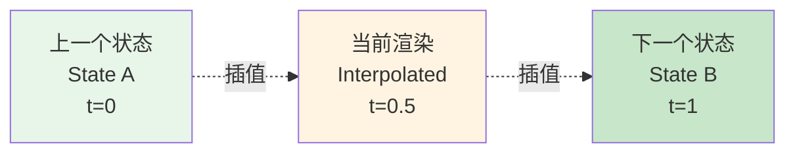

**线性插值 (Lerp)**:

$$
\vec{pos}(t) = \vec{pos}_A + (\vec{pos}_B - \vec{pos}_A) \cdot \alpha
$$

$$
\alpha = \frac{t - t_A}{t_B - t_A}
$$

> [!tip] 延迟缓冲
> RL 客户端会故意**延迟 100-200ms** 渲染其他玩家，保证有足够的状态数据用于平滑插值。

---

## 性能优化 (Performance Optimization)

### 关键技术

| 技术 | 目的 | 实现 |
|------|------|------|
| **固定时间步长** | 一致性 | 120Hz 物理更新 |
| **空间分割** | 加速碰撞检测 | Octree/Grid |
| **休眠机制** | 减少计算 | 静止物体不更新 |
| **碰撞层** | 过滤检测 | Ball vs Car only |
| **网络压缩** | 带宽优化 | Delta Compression |

### 内存布局

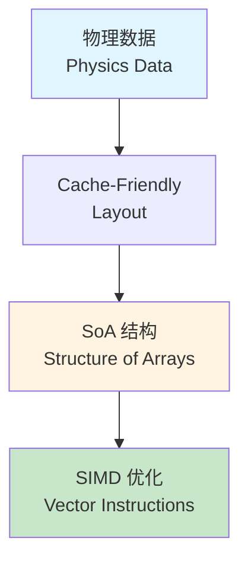

> [!example] 数据结构
> **AoS vs SoA**:
> ```cpp
> // AoS (Array of Structures) - 缓存不友好
> struct Vehicle {
>     Vector3 position;
>     Vector3 velocity;
>     Quaternion rotation;
> };
> Vehicle vehicles[100];
> 
> // SoA (Structure of Arrays) - SIMD 友好
> struct VehicleArray {
>     Vector3 positions[100];
>     Vector3 velocities[100];
>     Quaternion rotations[100];
> };
> ```

---

## 🎮 游戏性设计哲学

> [!quote] 设计原则
> "Physics-based, but not realistic. Responsive, but not arcade."
> 
> **基于物理，但不追求真实；响应灵敏，但不失真实感。**

### 关键平衡点

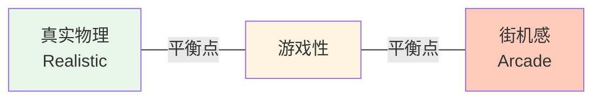

**RL 的选择**:
- ✅ **真实感**: 刚体碰撞、动量守恒、重力
- ✅ **可玩性**: 空中控制、无限推进器、快速响应
- ❌ **过度真实**: 燃料限制、车辆损坏、复杂操控

---

## 📚 扩展阅读

- [[车辆物理模拟|Advanced Vehicle Physics]]
- [[网络游戏同步|Networked Physics in Multiplayer Games]]
- [[PhysX 引擎|NVIDIA PhysX Documentation]]

---

## 🔗 相关资源

- 官方文档: [Rocket League Technical White Paper](https://www.unrealengine.com/)
- GDC 演讲: "The Physics of Rocket League"
- 开源项目: [RLBot](https://www.rlbot.org/) - AI 开发框架

---

## 💡 学习反思

> [!note] 关键收获
> 1. **固定时间步长**是多人物理游戏的基石
> 2. **客户端预测 + 服务器权威**解决延迟问题
> 3. **简化物理模型**不等于降低游戏质量
> 4. **游戏性优先**，物理真实性服务于可玩性

> [!question] 待深入研究
> - [ ] PhysX 约束求解器的内部实现
> - [ ] 如何处理高延迟环境 (>200ms)
> - [ ] 反作弊机制在物理模拟中的应用
> - [ ] 跨平台同步的额外挑战

---

#game-physics #multiplayer #networking #unreal-engine

^rocket-league-physics
