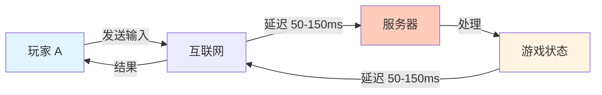
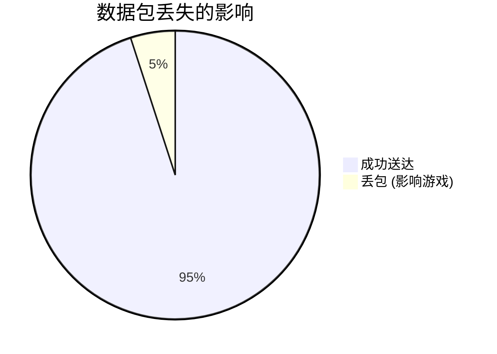
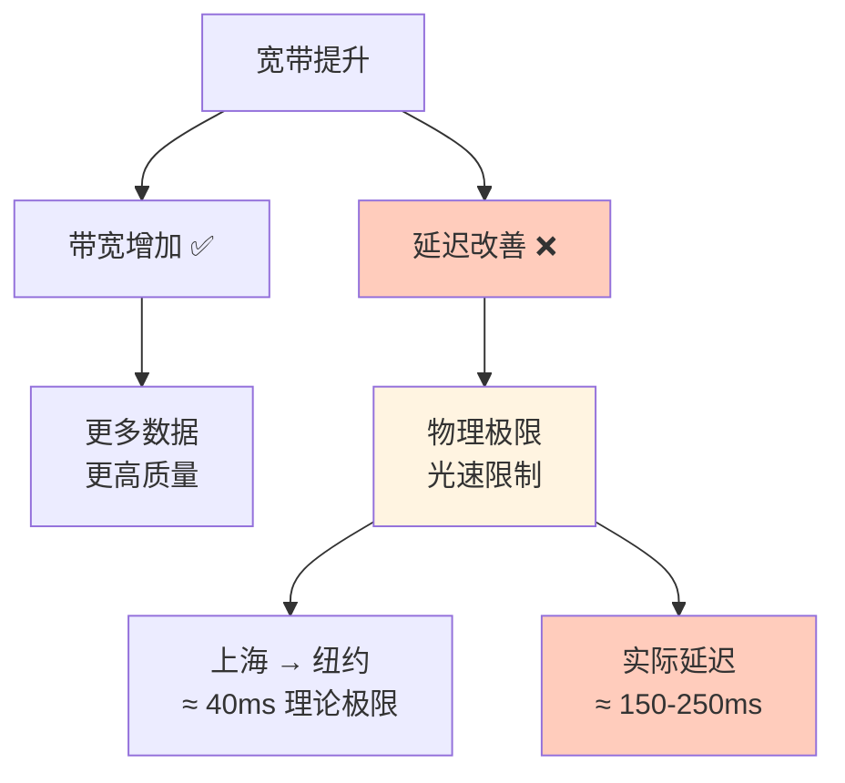
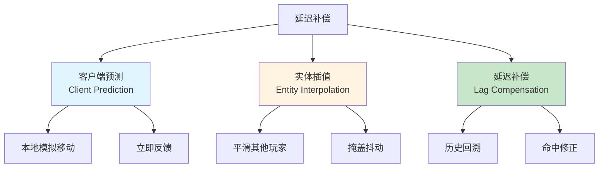
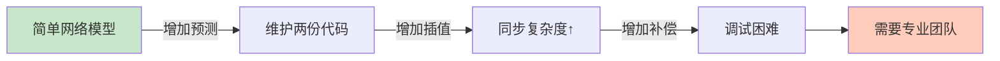
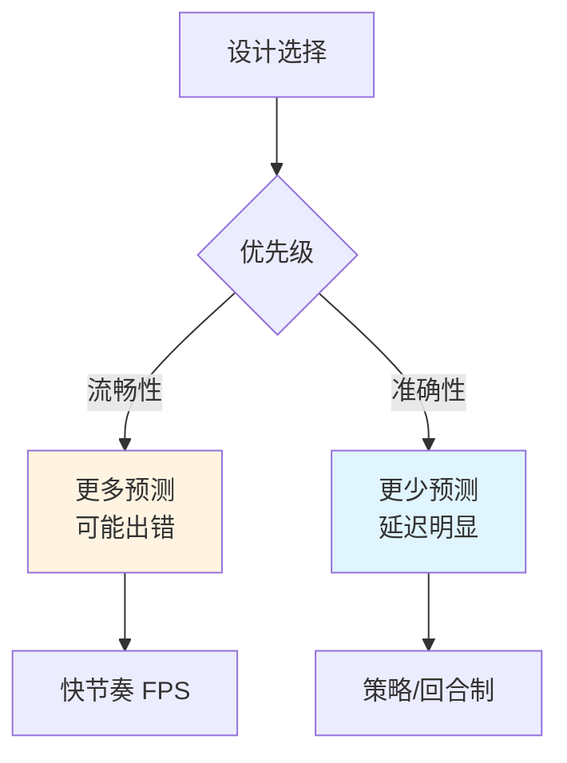
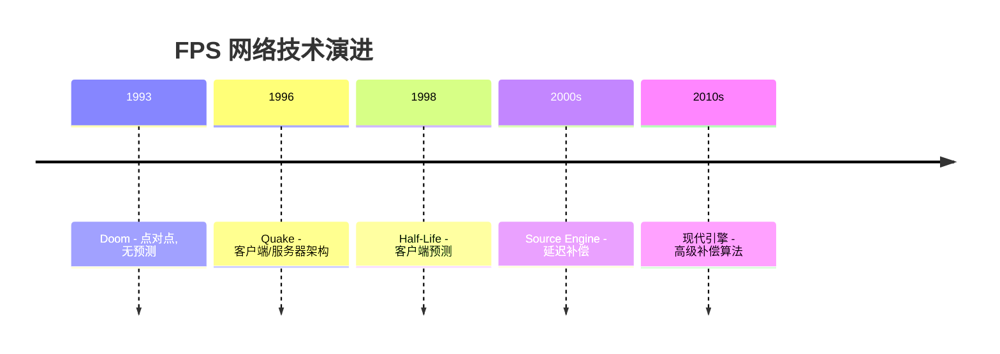
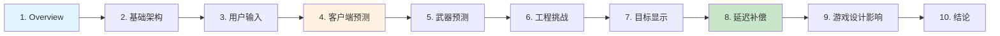

# 📡 Overview - 延迟补偿概述

> [!abstract] 章节摘要
> 本章介绍了在线动作游戏面临的核心挑战：**网络延迟**和**丢包**。即使在宽带时代，这些问题依然存在，必须通过技术手段掩盖其影响，为玩家提供流畅的游戏体验。

---

## 核心问题 (Core Challenges)

### 网络延迟的本质

**往返时延 (Round Trip Time, RTT)**:

$$
RTT = t_{send} + t_{process} + t_{receive}
$$

典型值：
- **局域网 (LAN)**: 1-5ms
- **城市内宽带**: 20-50ms
- **跨国宽带**: 100-300ms
- **卫星网络**: 600-1000ms

> [!danger] 人类感知阈值
> - **< 100ms**: 几乎察觉不到
> - **100-200ms**: 有轻微延迟感
> - **> 200ms**: 明显卡顿，严重影响体验

### 丢包问题

**丢包类型**:
1. **输入丢失**: 玩家操作未送达服务器
2. **状态丢失**: 服务器更新未送达客户端
3. **确认丢失**: ACK 包丢失导致重传

> [!warning] 游戏中的表现
> - 角色突然瞬移
> - 操作无响应
> - 子弹打空
> - "橡皮筋效应" (Rubber Banding)

---

## 宽带时代的挑战

### 为什么宽带不能解决问题？

> [!important] 光速限制
> $$
> t_{min} = \frac{distance}{c}
> $$
> 
> 即使以光速传输，上海到纽约的单程延迟也需要约 **40ms**。加上路由跳转、处理时间，实际 RTT 通常 > 150ms。

### 对比：离线 vs 在线游戏

| 方面 | 离线游戏 | 在线游戏 |
|------|---------|---------|
| **输入响应** | 瞬时 (< 1ms) | 延迟 (50-200ms) |
| **目标位置** | 准确 | 过时 (插值/预测) |
| **碰撞检测** | 精确 | 近似 (补偿) |
| **体验** | 完美流畅 | 需要优化 |

---

## 必须采取的措施

> [!quote] Valve 的观点
> "在高节奏的在线动作游戏中，如果不采用延迟掩盖技术，游戏几乎无法游玩。"

### 延迟补偿的三大支柱

1. **Client-Side Prediction** (客户端预测)
   - 玩家立即看到自己移动的效果
   - 减少操作延迟感

2. **Entity Interpolation** (实体插值)
   - 平滑其他玩家的移动
   - 掩盖网络抖动

3. **Lag Compensation** (延迟补偿)
   - 回溯历史状态进行命中判定
   - 保证"所见即所得"

---

## 技术挑战

### 工程复杂度

> [!warning] 代码维护成本
> - **双倍代码**: Client 和 Server 需要相同的物理/移动逻辑
> - **同步挑战**: 确保预测和权威状态一致
> - **调试地狱**: 网络问题难以复现和调试

### 权衡取舍

---

## 历史背景

### FPS 网络同步的演变

> [!example] 里程碑游戏
> - **Doom**: 简单的 peer-to-peer，延迟明显
> - **Quake**: 引入 authoritative server
> - **QuakeWorld**: 开创客户端预测
> - **Half-Life**: 完善预测系统
> - **Counter-Strike**: Lag Compensation 成为标配

---

## 关键数据

### 人类反应时间

| 反应类型 | 时间 | 游戏影响 |
|---------|------|---------|
| **视觉刺激** | 200-250ms | 看到敌人 → 开火 |
| **听觉刺激** | 140-160ms | 听到脚步 → 转身 |
| **肌肉反应** | 30-50ms | 手指按键 |
| **职业玩家** | 150-180ms | 综合反应 |

> [!tip] 设计启示
> 如果网络延迟 > 100ms，会显著超过玩家的反应时间，导致"操作与反馈脱节"。

---

## 学习路线

本系列文章将深入探讨以下主题：

---

## 延伸思考

> [!question] 讨论问题
> 1. 为什么云游戏 (Cloud Gaming) 的延迟问题更严重？
> 2. VR 游戏对延迟的要求为什么更高 (< 20ms)？
> 3. 格斗游戏如何处理延迟 (Rollback Netcode)?
> 4. 能否用 AI 预测玩家行为来进一步减少延迟感？

---

## 相关链接

- Next: [[02_Basic_Architecture|基础架构]]
- Related: [[Rocket League 物理系统详解|Rocket League 网络同步]]
- Reference: [Valve Developer Wiki](https://developer.valvesoftware.com/)

---

#source-engine #networking #latency #game-development #valve

^latency-overview
