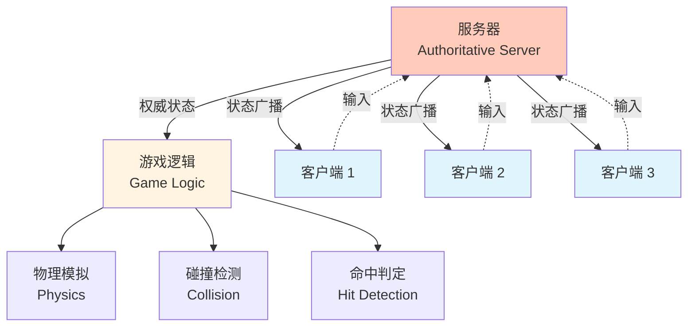
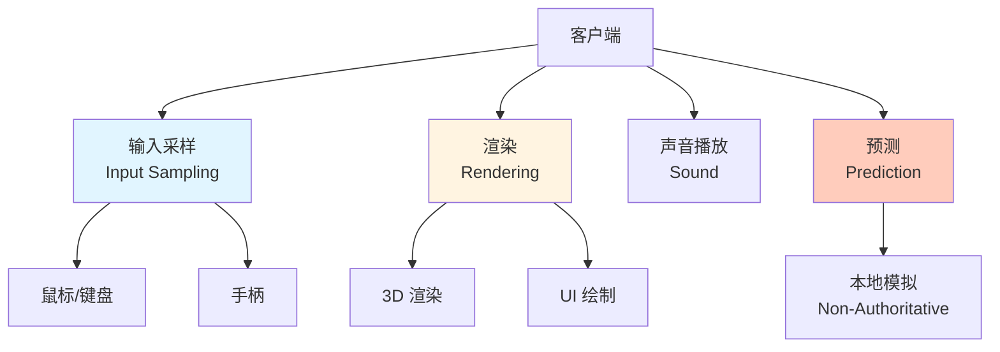
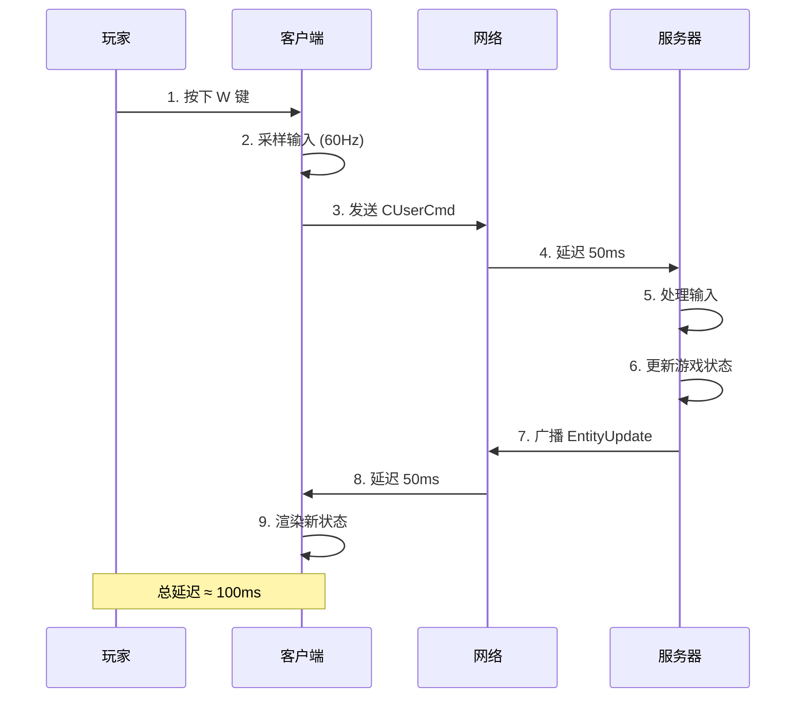
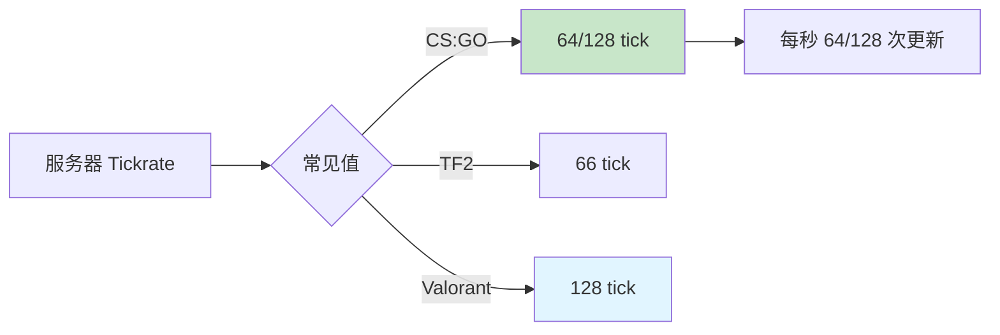
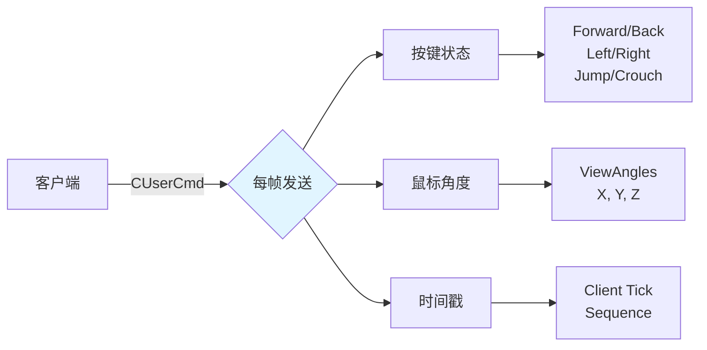
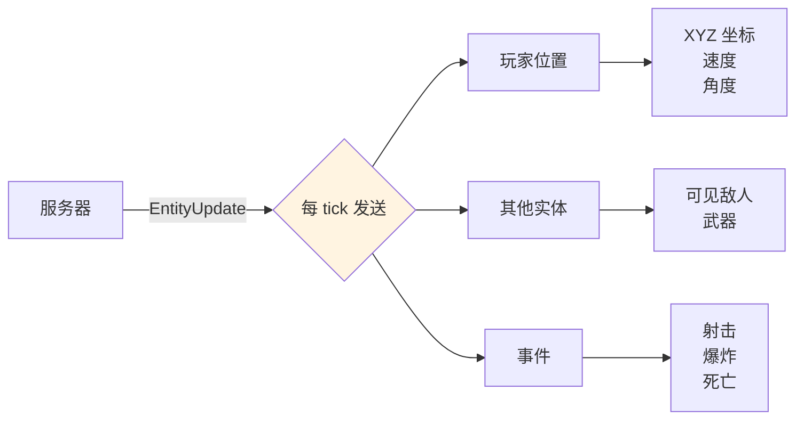
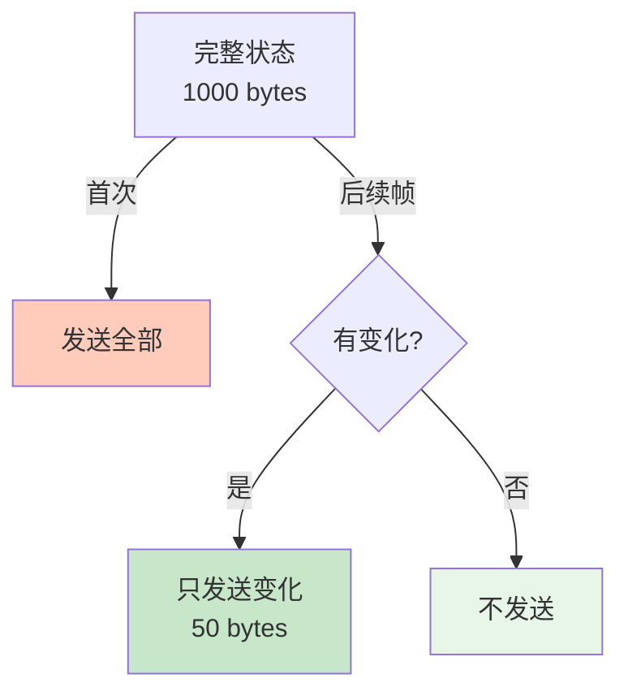
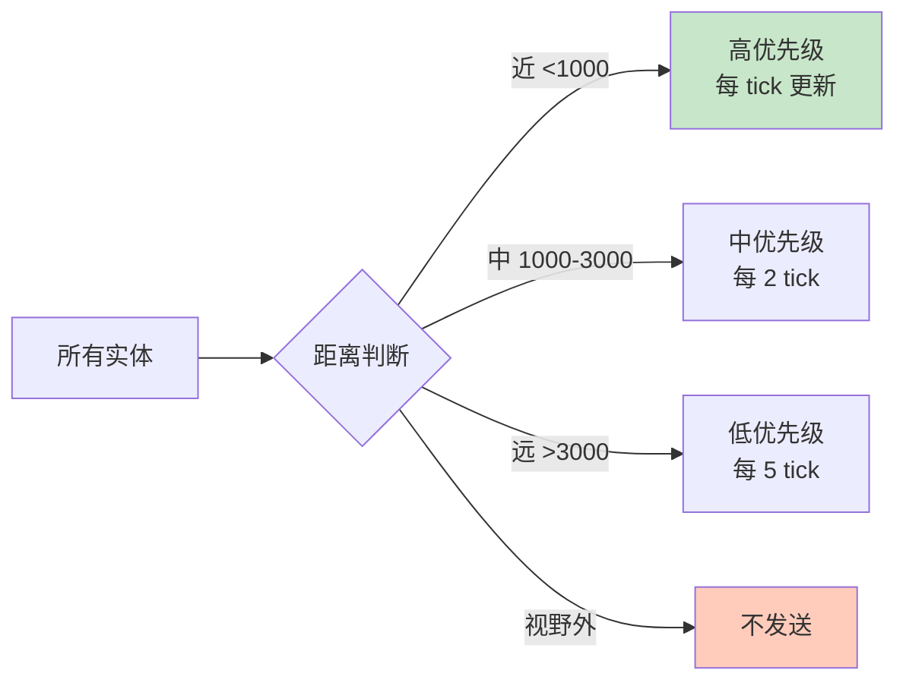

# 🏗️ Basic Architecture - 客户端/服务器基础架构

> [!abstract] 章节摘要
> 本章详细介绍了**权威服务器 (Authoritative Server)** 模型的核心原理。服务器是游戏状态的唯一真实来源，客户端仅负责输入采样和渲染。这种架构是现代多人FPS游戏的基石。

---

## 权威服务器模型 (Authoritative Server)

### 核心原则



> [!important] 单一真相来源 (Single Source of Truth)
> **服务器**是游戏状态的唯一权威，所有重要决策都由服务器做出：
> - 玩家位置
> - 生命值和弹药
> - 谁命中了谁
> - 游戏规则执行

### 为什么需要权威服务器？

**对比：Peer-to-Peer vs Client-Server**

```mermaid
graph LR
    subgraph Peer-to-Peer (Doom)
        P1[玩家1] <-->|直连| P2[玩家2]
        P2 <--> P3[玩家3]
        P3 <--> P1
    end
    
    subgraph Client-Server (Quake/Half-Life)
        S[服务器] --> C1[客户端1]
        S --> C2[客户端2]
        S --> C3[客户端3]
    end
    
    style P1 fill:#ffccbc
    style P2 fill:#ffccbc
    style P3 fill:#ffccbc
    style S fill:#c8e6c9
```

| 方面 | Peer-to-Peer | Client-Server |
|------|--------------|---------------|
| **作弊防护** | ❌ 极易作弊 | ✅ 服务器验证 |
| **一致性** | ❌ 状态分歧 | ✅ 单一真相 |
| **扩展性** | ❌ 玩家数↑延迟↑ | ✅ 支持多玩家 |
| **复杂度** | 简单 | 较复杂 |

> [!danger] P2P 的致命缺陷
> 在 Peer-to-Peer 模式下，每个客户端都是"真相"，导致：
> - **同步噩梦**: 不同客户端看到不同的世界状态
> - **作弊天堂**: 修改内存直接生效
> - **延迟放大**: 需要等待最慢的玩家

---

## 客户端的角色

### 职责分工



> [!tip] 客户端定位
> 客户端是一个"**哑终端 + 聪明的渲染器**"：
> - **哑终端**: 不做权威决策
> - **聪明渲染**: 预测和插值掩盖延迟

### 输入到显示的流程



---

## 服务器的职责

### 游戏循环

```cpp
// 服务器主循环 (伪代码)
void GameServer::RunFrame(float deltaTime) {
    // 1. 接收所有客户端的输入
    for (Client& client : clients) {
        CUserCmd cmd = client.GetPendingCommand();
        PlayerMove(client.player, cmd, deltaTime);
    }
    
    // 2. 运行游戏逻辑
    RunGameRules();
    
    // 3. 物理模拟
    PhysicsSimulate(deltaTime);
    
    // 4. 碰撞检测
    CheckCollisions();
    
    // 5. 命中判定
    ProcessWeaponFire();
    
    // 6. 广播状态更新
    for (Client& client : clients) {
        SendEntityUpdates(client);
    }
}
```

### 更新频率



> [!important] Tickrate 的影响
> $$
> \Delta t = \frac{1}{tickrate}
> $$
> 
> - **64 tick**: 15.625ms per frame
> - **128 tick**: 7.8125ms per frame
> 
> **更高的 tickrate** = 更精确的模拟，但服务器负担更重

---

## 数据流详解

### 上行：客户端 → 服务器



典型数据包大小：**20-50 bytes**

### 下行：服务器 → 客户端



典型数据包大小：**100-500 bytes** (取决于可见实体数量)

---

## 网络优化技术

### Delta Compression (增量压缩)



**示例**:
```cpp
// Frame 1: 发送完整状态
EntityState state1 = {
    position: (100, 200, 50),
    health: 100,
    ammo: 30
};

// Frame 2: 只发送变化
EntityDelta delta = {
    position: (101, 200, 50),  // X 变化了 +1
    // health 和 ammo 未变化，不发送
};
```

### Priority & Relevance (优先级与相关性)



---

## Half-Life / Source Engine 特色

### 实体系统

```cpp
class CBaseEntity {
    Vector position;
    Vector velocity;
    int health;
    int team;
    
    virtual void Think();       // 逻辑更新
    virtual void Touch(CBaseEntity* other); // 碰撞回调
};

class CBasePlayer : public CBaseEntity {
    CUserCmd currentCommand;
    
    void PlayerMove(float deltaTime) {
        // 移动逻辑
        ApplyGravity();
        ApplyFriction();
        ProcessInput(currentCommand);
        CheckGround();
    }
};
```

### Network Variables

```cpp
// Networking 声明
class CWeapon : public CBaseEntity {
    DECLARE_DATADESC();
    
    CNetworkVar(int, m_iClip1);      // 自动同步到客户端
    CNetworkVar(float, m_flNextPrimaryAttack);
};

// 服务器修改后自动发送到客户端
weapon->m_iClip1 = 20;  // 客户端会收到更新
```

---

## 架构优势

> [!success] 权威服务器的好处
> 1. **防作弊**: 客户端无法直接修改重要状态
> 2. **一致性**: 所有玩家看到同一个游戏世界
> 3. **可靠性**: 服务器控制游戏规则
> 4. **录像/回放**: 服务器记录完整游戏数据

> [!warning] 代价
> - **延迟**: 必须等待服务器确认
> - **带宽**: 服务器需要足够上传速度
> - **成本**: 运营专用服务器的费用

---

## 相关链接

- Previous: [[01_Overview|Overview]]
- Next: [[03_User_Input|用户输入]]
- Related: [[Rocket League 物理系统详解|RL 网络架构]]

---

#source-engine #client-server #architecture #networking #valve

^basic-architecture
