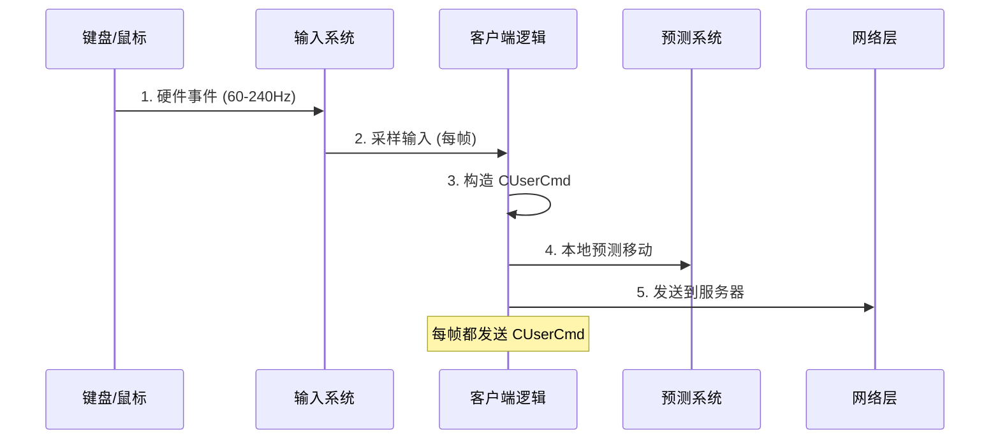
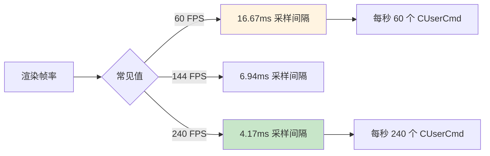
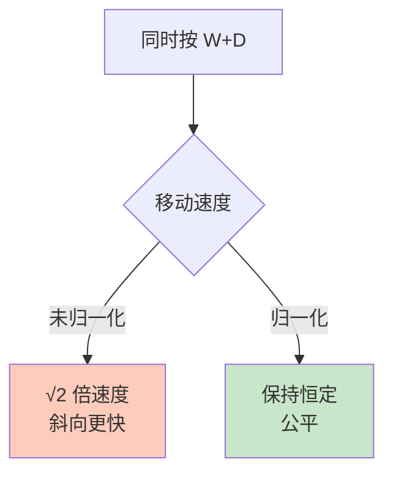
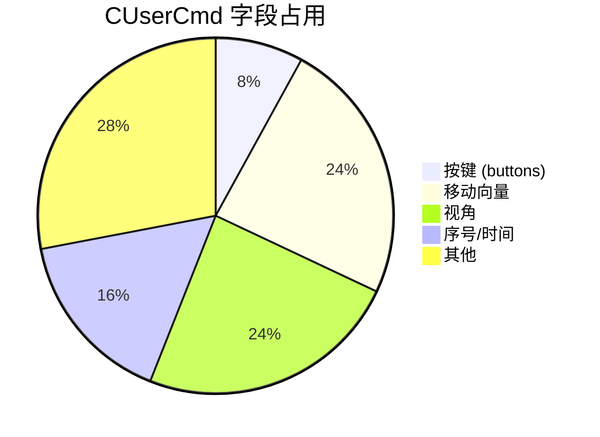
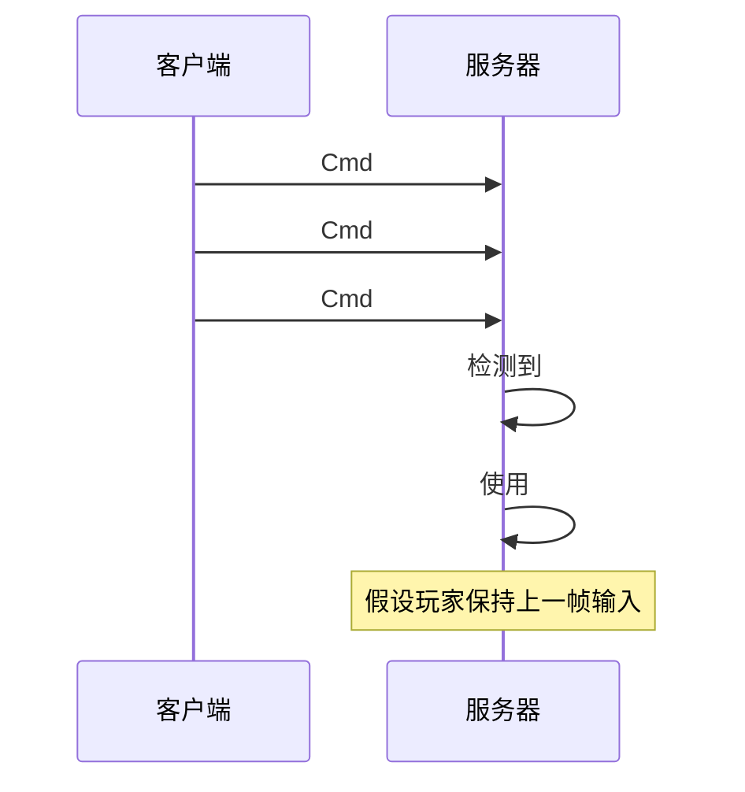

# ⌨️ User Input Messages - 用户输入消息

> [!abstract] 章节摘要
> 本章详细解析客户端发送给服务器的**CUserCmd (User Command)** 数据结构，包含玩家的按键状态、视角方向、时间戳等核心信息。这些数据是服务器模拟玩家行为的唯一输入。

---

## CUserCmd 数据结构

### 核心字段

```cpp
class CUserCmd {
public:
    // 时间信息
    int command_number;      // 命令序号 (递增)
    int tick_count;          // 客户端 tick 数
    
    // 视角
    QAngle viewangles;       // 俯仰/偏航/翻滚角度
    
    // 移动
    float forwardmove;       // -450 到 +450 (W/S)
    float sidemove;          // -450 到 +450 (A/D)
    float upmove;            // -320 到 +320 (跳跃/下蹲)
    
    // 按键
    int buttons;             // 位掩码 (ATTACK, JUMP, DUCK 等)
    byte impulse;            // 武器切换等一次性指令
    
    // 武器选择
    int weaponselect;
    int weaponsubtype;
    
    // 鼠标增量 (可选)
    short mousedx;
    short mousedy;
};
```

### 按键位掩码

```cpp
enum ButtonBits {
    IN_ATTACK   = (1 << 0),   // 主要攻击
    IN_JUMP     = (1 << 1),   // 跳跃
    IN_DUCK     = (1 << 2),   // 下蹲
    IN_FORWARD  = (1 << 3),   // 前进
    IN_BACK     = (1 << 4),   // 后退
    IN_USE      = (1 << 5),   // 使用/交互
    IN_MOVELEFT = (1 << 9),   // 左移
    IN_MOVERIGHT= (1 << 10),  // 右移
    IN_ATTACK2  = (1 << 11),  // 次要攻击 (右键)
    IN_RUN      = (1 << 12),  // 奔跑
    IN_RELOAD   = (1 << 13),  // 装弹
    IN_SPEED    = (1 << 17),  // 慢走
    IN_ZOOM     = (1 << 19),  // 瞄准
    // ... 更多
};
```

---

## 输入采样流程



### 采样频率



> [!tip] 高刷新率的优势
> 更高的帧率 = 更密集的输入采样 = 更精确的移动轨迹

---

## 移动向量计算

### forwardmove & sidemove

```cpp
// 基于按键计算移动向量
float forwardmove = 0.0f;
float sidemove = 0.0f;

if (keys & IN_FORWARD)  forwardmove += cl_forwardspeed;   // +450
if (keys & IN_BACK)     forwardmove -= cl_backspeed;      // -450
if (keys & IN_MOVELEFT) sidemove -= cl_sidespeed;         // -450
if (keys & IN_MOVERIGHT)sidemove += cl_sidespeed;         // +450

// 慢走修正
if (keys & IN_SPEED) {
    forwardmove *= 0.52f;
    sidemove *= 0.52f;
}
```

### 向量归一化问题



```cpp
// Source Engine 的处理
Vector wishdir = Vector(forwardmove, sidemove, 0);
float wishspeed = wishdir.Normalize();  // 返回长度
wishspeed = min(wishspeed, maxspeed);   // 限制最大速度
```

> [!important] 对角线移动
> 早期游戏未归一化导致"bunny hopping"时对角线移动更快，现代引擎已修复。

---

## 视角更新

### ViewAngles 详解

```cpp
struct QAngle {
    float pitch;  // 俯仰 (-90° 到 +90°)
    float yaw;    // 偏航 (0° 到 360°)
    float roll;   // 翻滚 (通常为 0)
};

// CS:GO 示例
QAngle viewangles;
viewangles.pitch = -15.0f;  // 向下看 15 度
viewangles.yaw = 90.0f;     // 面向东
viewangles.roll = 0.0f;     // 不倾斜
```

### 鼠标灵敏度

```cpp
// 鼠标移动 → 视角变化
float mouseSensitivity = 2.5f;
float m_pitch = 0.022f;  // 垂直灵敏度
float m_yaw = 0.022f;    // 水平灵敏度

viewangles.pitch += mousedy * m_pitch * sensitivity;
viewangles.yaw += mousedx * m_yaw * sensitivity;

// 限制俯仰角
viewangles.pitch = clamp(viewangles.pitch, -89.0f, 89.0f);
```

---

## 网络传输优化

### 数据包大小

原始 `CUserCmd` 大小：**≈ 50 bytes**



### 压缩技术

```cpp
// 增量编码 (Delta Encoding)
if (cmd.buttons == lastCmd.buttons) {
    // 只发送 "unchanged" 标记
    WriteBit(0);
} else {
    WriteBit(1);
    WriteInt(cmd.buttons);
}

// 量化 (Quantization)
// 视角不需要 float 精度
short compressedPitch = (short)(viewangles.pitch * 100);
// 0.01 度精度足够
```

---

## 命令序号与可靠性

### Command Number

```cpp
static int s_nCommandNumber = 0;

CUserCmd* CreateCommand() {
    CUserCmd cmd;
    cmd.command_number = ++s_nCommandNumber;
    cmd.tick_count = clientTick;
    return cmd;
}
```

### 丢包处理



> [!warning] 丢包影响
> 服务器会**重复上一帧输入**来填补丢失的命令，导致：
> - 短暂的"卡顿"感
> - 移动方向可能不准确

---

## 实战示例

### 射击检测

```cpp
void ProcessUserCmd(CUserCmd* cmd) {
    // 1. 更新视角
    player->SetViewAngles(cmd->viewangles);
    
    // 2. 移动
    player->Move(cmd->forwardmove, cmd->sidemove);
    
    // 3. 检测射击
    if (cmd->buttons & IN_ATTACK) {
        if (weapon->CanFire()) {
            FireWeapon(player, cmd->viewangles);
        }
    }
    
    // 4. 跳跃
    if (cmd->buttons & IN_JUMP) {
        player->Jump();
    }
}
```

---

## 安全性考虑

### 输入验证

```cpp
// 服务器必须验证输入合法性
bool ValidateUserCmd(CUserCmd* cmd) {
    // 1. 视角范围检查
    if (cmd->viewangles.pitch < -90 || cmd->viewangles.pitch > 90)
        return false;
    
    // 2. 移动速度检查
    if (abs(cmd->forwardmove) > 500 || abs(cmd->sidemove) > 500)
        return false;
    
    // 3. 时间戳递增检查
    if (cmd->tick_count <= lastTickCount)
        return false;
    
    return true;
}
```

> [!danger] 作弊检测
> 常见作弊手段：
> - **Speed Hack**: 发送过大的 move 值
> - **Aim Bot**: 瞬间改变 viewangles
> - **Trigger Bot**: 在不可能的时机按 IN_ATTACK

---

## 相关链接

- Previous: [[02_Basic_Architecture|基础架构]]
- Next: [[04_Client_Prediction|客户端预测]]

---

#source-engine #input #networking #command

^user-input
