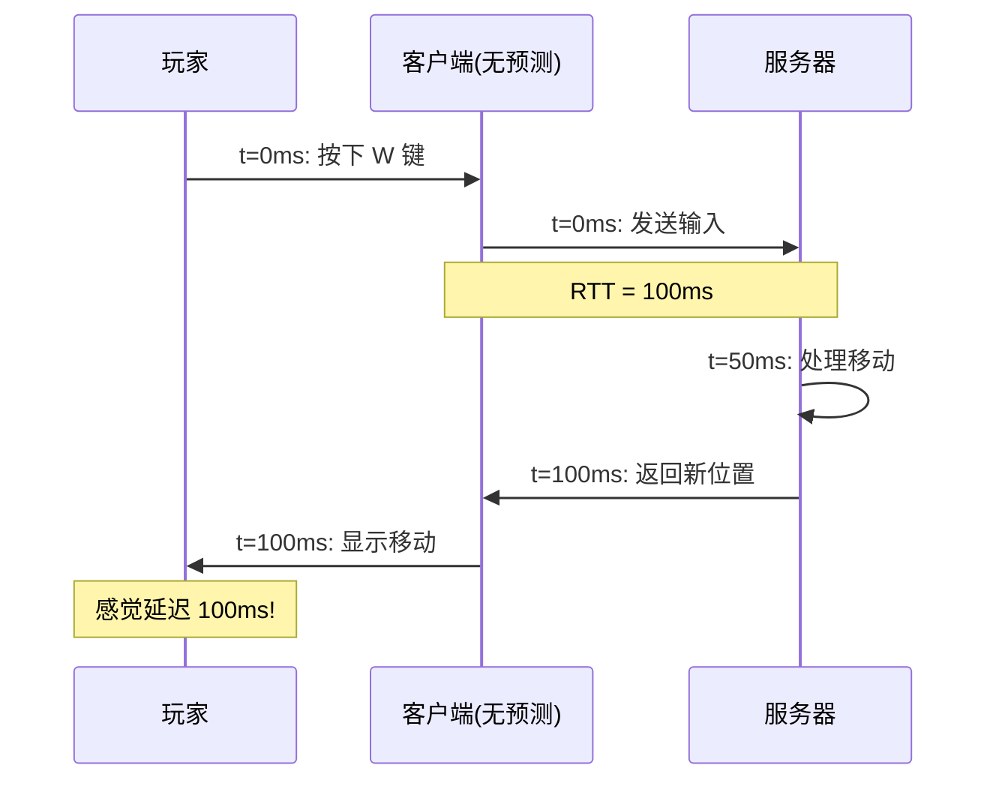
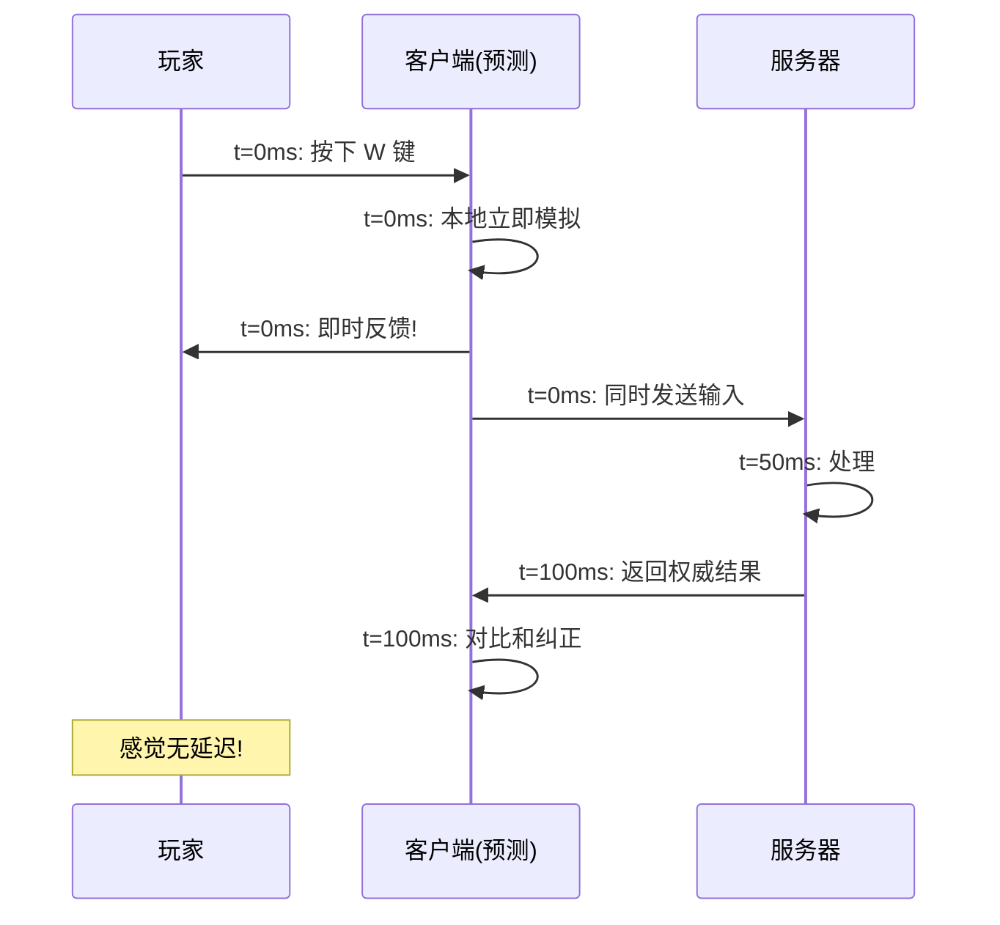
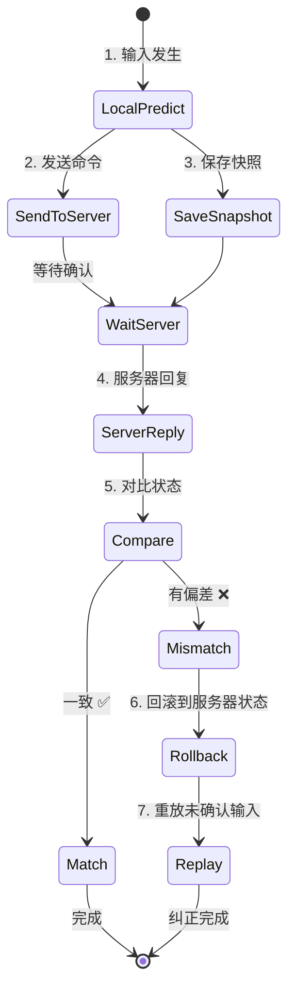
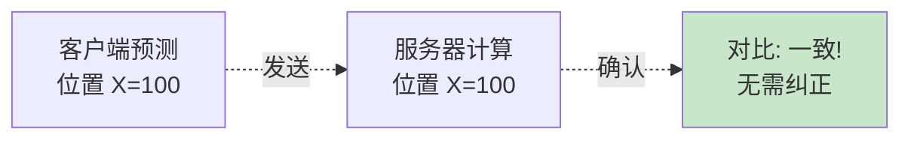
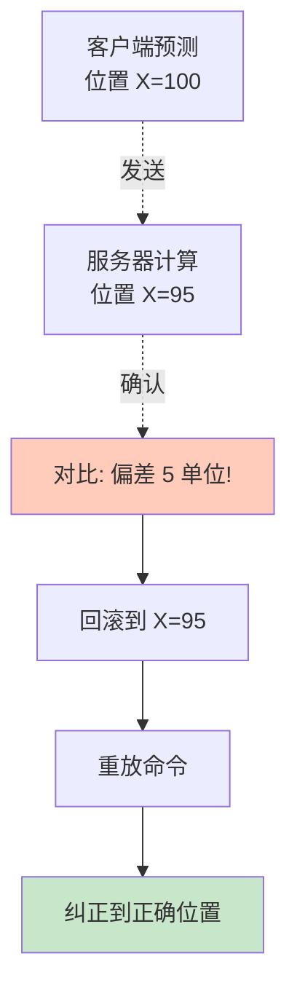
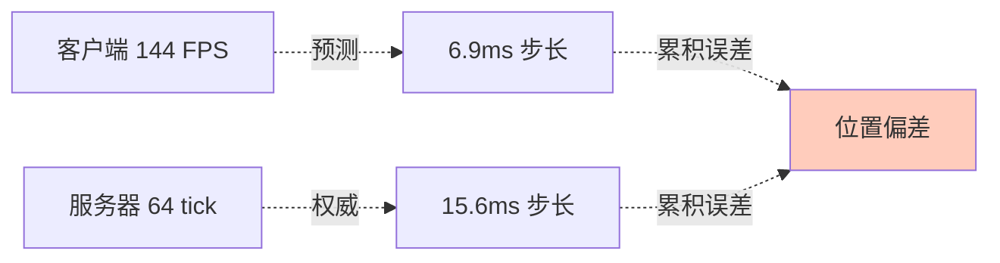

# 🔮 Client Prediction - 客户端预测

> [!abstract] 章节摘要
> **客户端预测** (Client-Side Prediction) 是延迟补偿的第一大支柱。通过在客户端本地模拟玩家移动，玩家可以**立即**看到自己的操作反馈，无需等待服务器确认，从而掩盖网络延迟。

---

## 核心原理

### 问题：无预测的延迟感



> [!danger] 无法接受
> 100ms 的延迟会让游戏感觉"黏糊糊"，像在水里移动。

### 解决方案：本地预测



> [!success] 完美掩盖
> 玩家**立即**看到自己移动，感觉就像本地单人游戏。

---

## Rollback & Replay (回滚与重放)

### 核心机制



### 数据结构

```cpp
class CPrediction {
    // 快照历史
    CUtlVector<CPlayerSnapshot> snapshots;
    
    // 未确认的命令
    CUtlVector<CUserCmd> pendingCommands;
    
    int lastAckedCommand;  // 服务器确认的最后一个命令号
};

struct CPlayerSnapshot {
    int commandNumber;
    Vector position;
    Vector velocity;
    int flags;  // 地面/空中等状态
    // ... 更多状态
};
```

---

## 预测流程详解

### 步骤 1: 本地模拟

```cpp
void ClientPrediction::RunPrediction(CUserCmd* cmd) {
    // 1. 保存当前状态
    SaveSnapshot(cmd->command_number);
    
    // 2. 使用与服务器相同的代码模拟移动
    player->PlayerMove(cmd);
    
    // 3. 保存命令到未确认列表
    pendingCommands.AddToTail(*cmd);
}
```

> [!important] 代码一致性
> 客户端和服务器**必须使用完全相同的移动代码**，否则预测会不准确。

### 步骤 2: 服务器确认

```cpp
void ClientPrediction::OnServerUpdate(int ackedCommand, Vector serverPos) {
    // 找到服务器确认的快照
    CPlayerSnapshot* snapshot = FindSnapshot(ackedCommand);
    
    // 对比预测结果和服务器结果
    float error = (serverPos - snapshot->position).Length();
    
    if (error > TOLERANCE) {
        // 预测失败，需要纠正
        Rollback(ackedCommand, serverPos);
    } else {
        // 预测成功，清理旧快照
        CleanupSnapshots(ackedCommand);
    }
}
```

### 步骤 3: 回滚与重放

```cpp
void ClientPrediction::Rollback(int ackedCommand, Vector serverPos) {
    // 1. 回滚到服务器状态
    player->SetPosition(serverPos);
    player->SetVelocity(serverVel);
    
    // 2. 重放未确认的命令
    for (int i = ackedCommand + 1; i <= currentCommand; i++) {
        CUserCmd* cmd = GetCommand(i);
        player->PlayerMove(cmd);  // 重新模拟
    }
    
    // 3. 更新显示
    player->UpdateVisuals();
}
```

---

## 可视化示例

### 预测成功场景



### 预测失败场景



---

## 预测误差来源

### 1. 浮点精度

```cpp
// 客户端
float velocity = 100.0f;
velocity *= 0.1f;  // = 10.0

// 服务器 (不同编译器/架构)
float velocity = 100.0f;
velocity *= 0.1f;  // = 9.999999
```

> [!tip] 解决方案
> 使用固定点数学或容差比较：
> ```cpp
> if (fabs(clientPos - serverPos) > 0.1f) {
>     // 误差超过阈值才纠正
> }
> ```

### 2. 随机数不同步

```cpp
// ❌ 错误：客户端和服务器不同的随机数
float spread = RandomFloat(-1.0f, 1.0f);

// ✅ 正确：使用命令序号作为种子
RandomSeed(cmd->command_number);
float spread = RandomFloat(-1.0f, 1.0f);
```

### 3. 帧率不同



> [!warning] 固定时间步长
> 服务器使用固定 tickrate，客户端也应该用相同步长模拟。

---

## 优化技巧

### 快照压缩

```cpp
// 只保存必要的状态
struct CPlayerSnapshot {
    short x, y, z;  // 位置量化到 short
    short vx, vy, vz; // 速度量化
    byte flags;     // 状态位
};

// 相比完整状态节省 70% 内存
```

### 延迟快照清理

```cpp
void CleanupSnapshots(int ackedCommand) {
    // 只保留最近 100 个快照
    while (snapshots.Count() > 100) {
        snapshots.Remove(0);
    }
    
    // 或保留最近 1 秒的快照
    int cutoffTime = currentTime - 1000;
    snapshots.RemoveMultiple([](auto& s) {
        return s.timestamp < cutoffTime;
    });
}
```

---

## 实战问题

### Q: 为什么有时会看到"抖动"？

```mermaid
graph TD
    A[预测 X=100] --> B[服务器 X=95]
    B --> C[回滚到 95]
    C --> D[重放: 预测到 100]
    D --> E[服务器又更新: X=96]
    E --> F[再次回滚...]
    
    Note over A,F: 反复纠正 = 视觉抖动
    
    style F fill:#ffccbc
```

**解决方案**: 增加容差，小偏差不纠正。

### Q: 移动代码能有分歧吗？

> [!danger] 绝对不行
> 如果客户端移动代码与服务器不同：
> - 预测永远不准
> - 每帧都回滚
> - 游戏无法游玩

**Source Engine 做法**: `shared` 文件夹，客户端/服务器编译相同代码。

---

## 相关链接

- Previous: [[03_User_Input|用户输入]]
- Next: [[05_Weapon_Firing_Prediction|武器发射预测]]

---

#source-engine #prediction #client-side #rollback

^client-prediction
