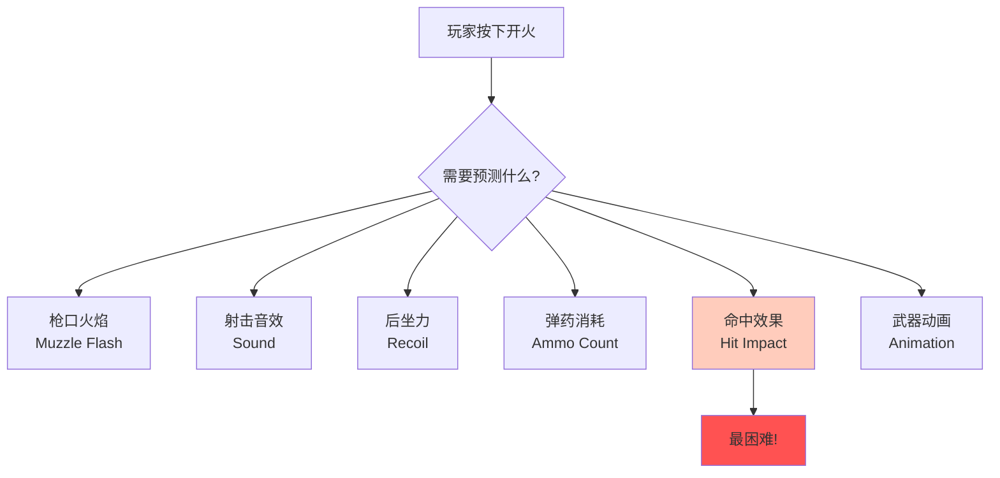
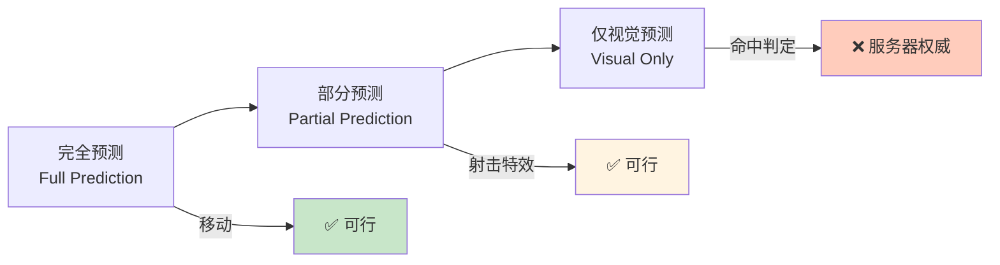
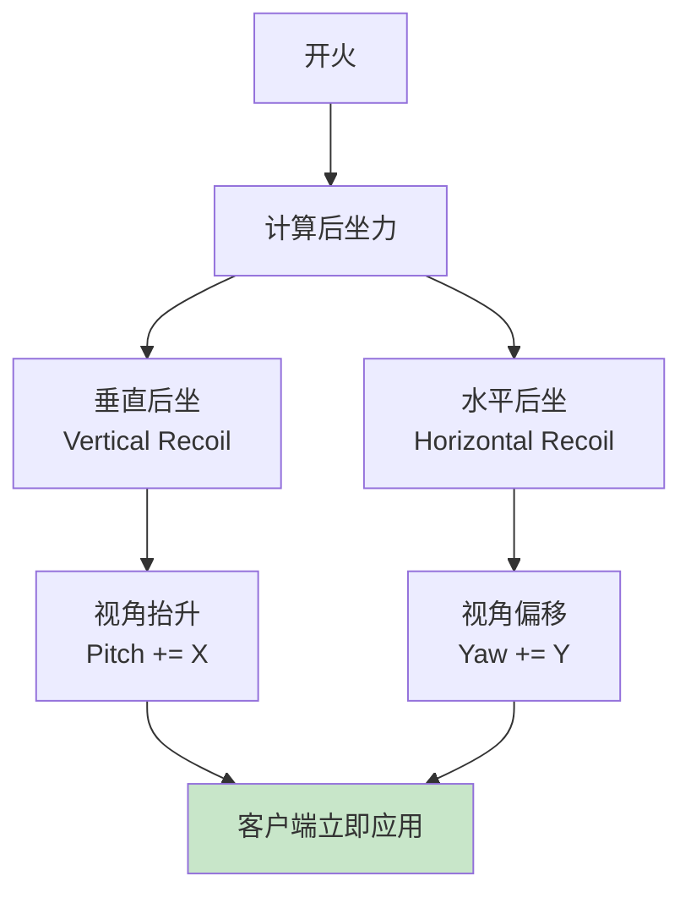
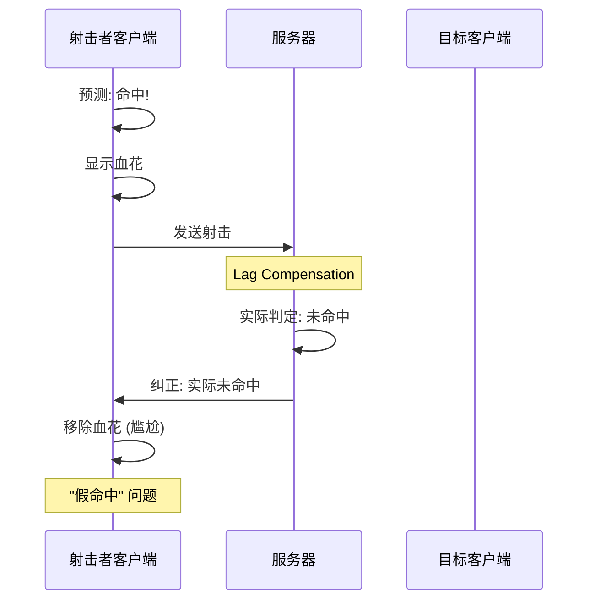
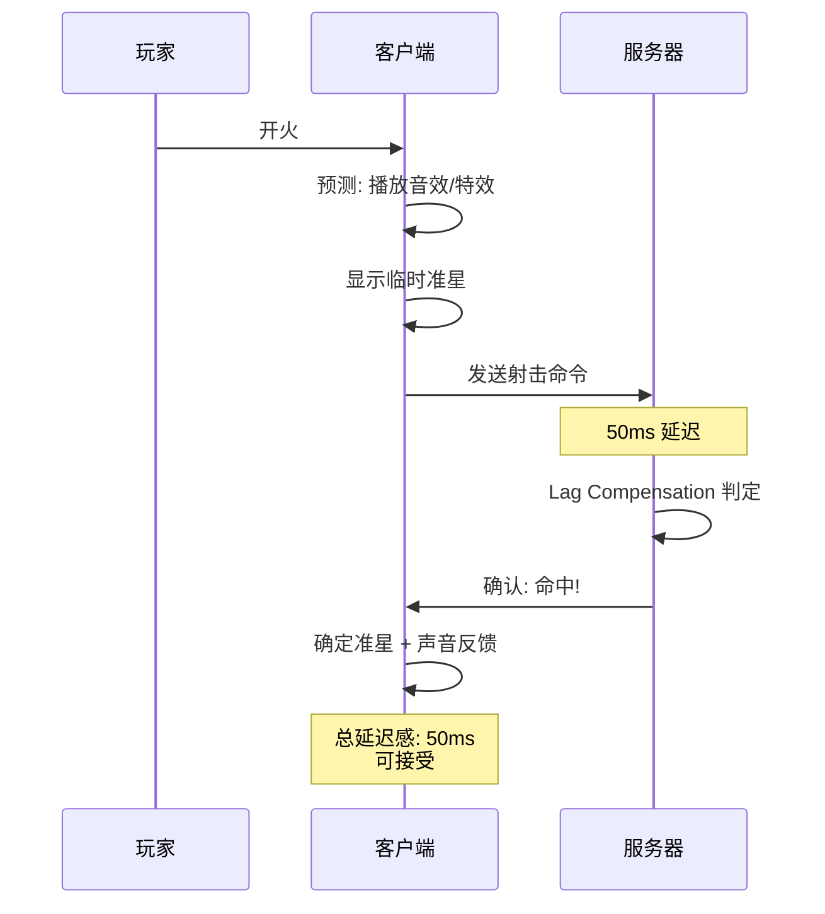
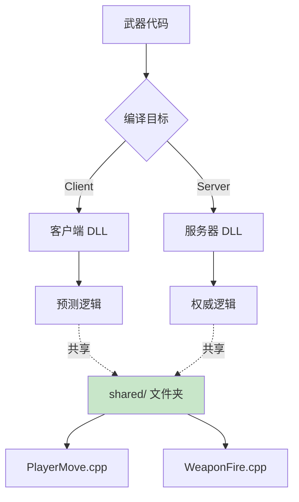
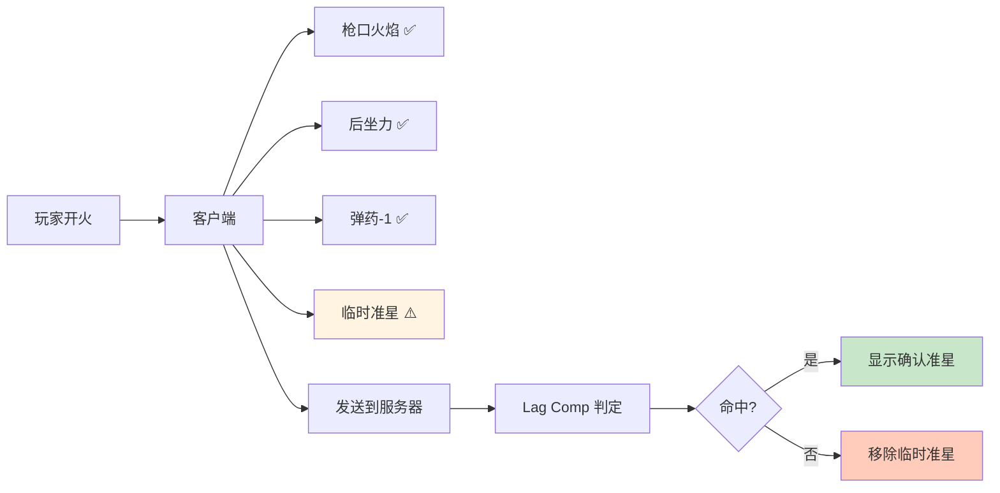

# 🔫 Weapon Firing Prediction - 武器发射预测

> [!abstract] 章节摘要
> 在客户端预测移动之后，下一个挑战是**预测武器发射效果**。玩家按下开火键时，必须立即看到枪口火焰、后坐力、弹药减少等反馈，否则游戏手感会非常糟糕。这比移动预测复杂得多。

---

## 核心挑战

### 问题分析



> [!danger] 命中判定的难题
> **移动预测**只影响自己，但**射击预测**涉及其他玩家：
> - 我打中了谁？
> - 对方是否已经移动？
> - 服务器会同意我的判断吗？

---

## 预测层级

### 三层预测策略



### 分类实现

| 元素 | 预测方式 | 原因 |
|------|---------|------|
| **枪口火焰** | 完全预测 | 纯视觉，无副作用 |
| **射击音效** | 完全预测 | 即时反馈很重要 |
| **后坐力** | 完全预测 | 影响下一发瞄准 |
| **弹药计数** | 完全预测 | UI 反馈 |
| **命中判定** | 服务器权威 | 防作弊 |
| **伤害应用** | 服务器权威 | 防作弊 |
| **击杀确认** | 服务器权威 | 避免"假击杀" |

---

## 视觉效果预测

### 枪口火焰

```cpp
void CPredictedWeapon::PrimaryAttack() {
    // 客户端立即播放
    if (prediction->InPrediction()) {
        // 1. 枪口火焰粒子
        DispatchParticleEffect("weapon_muzzle_flash", 
                               PATTACH_POINT_FOLLOW, 
                               this, 
                               "muzzle");
        
        // 2. 射击音效
        EmitSound("Weapon.Fire");
        
        // 3. 武器动画
        SendWeaponAnim(ACT_VM_PRIMARYATTACK);
    }
    
    // 服务器也执行 (广播给其他客户端)
    if (gpGlobals->IsServer()) {
        BroadcastMuzzleFlash();
    }
}
```

### 弹壳抛出

```cpp
void EjectBrassShell() {
    // 客户端预测抛壳
    if (prediction->InPrediction()) {
        CBaseEntity* shell = CreateEntityByName("brass_shell");
        
        // 随机抛出方向
        Vector forward, right, up;
        GetVectors(&forward, &right, &up);
        
        Vector velocity = right * RandomFloat(50, 70) 
                        + up * RandomFloat(100, 150)
                        + forward * RandomFloat(-10, 10);
        
        shell->SetAbsVelocity(velocity);
        shell->SetAbsAngularVelocity(RandomAngle());
    }
}
```

> [!tip] 随机数同步
> 注意：**弹壳位置不需要同步**，每个客户端看到不同的弹壳也无所谓（纯视觉）。

---

## 武器状态预测

### 弹药管理

```cpp
class CPredictedWeapon : public CBaseWeapon {
    // 网络变量 (自动同步)
    CNetworkVar(int, m_iClip1);           // 主弹夹
    CNetworkVar(int, m_iAmmo1);            // 备用弹药
    CNetworkVar(float, m_flNextPrimaryAttack);  // 下次开火时间
    
public:
    void PrimaryAttack() {
        // 检查是否能开火
        if (m_flNextPrimaryAttack > gpGlobals->curtime)
            return;
        
        if (m_iClip1 <= 0) {
            // 需要换弹
            Reload();
            return;
        }
        
        // 预测弹药消耗
        m_iClip1--;
        
        // 预测下次开火时间
        m_flNextPrimaryAttack = gpGlobals->curtime + GetFireRate();
        
        // 执行射击
        FireBullet();
    }
};
```

### 换弹预测

```cpp
void CPredictedWeapon::Reload() {
    // 检查能否换弹
    if (m_iClip1 >= GetMaxClip1()) return;
    if (m_iAmmo1 <= 0) return;
    
    // 预测换弹
    if (prediction->InPrediction()) {
        // 1. 播放换弹动画
        SendWeaponAnim(ACT_VM_RELOAD);
        
        // 2. 播放音效
        WeaponSound(RELOAD);
        
        // 3. 设置换弹时间
        m_flNextPrimaryAttack = gpGlobals->curtime + GetReloadTime();
        
        // 4. 预测弹药变化
        int ammoToReload = min(GetMaxClip1() - m_iClip1, m_iAmmo1);
        m_iClip1 += ammoToReload;
        m_iAmmo1 -= ammoToReload;
    }
}
```

---

## 后坐力预测

### Recoil Pattern



```cpp
void ApplyRecoil() {
    QAngle recoilAngles;
    
    // 垂直后坐 (向上)
    recoilAngles.x = -RandomFloat(1.0f, 2.0f);  // Pitch
    
    // 水平后坐 (左右抖动)
    recoilAngles.y = RandomFloat(-0.5f, 0.5f);  // Yaw
    
    // 立即修改玩家视角
    player->SetLocalAngles(player->GetLocalAngles() + recoilAngles);
    
    // 添加 punch angle (屏幕震动)
    player->ViewPunch(recoilAngles * 0.5f);
}
```

### 连发后坐力累积

```cpp
class CWeaponRecoil {
    float recoilAccumulation;
    int consecutiveShots;
    
public:
    Vector2D CalculateRecoil() {
        consecutiveShots++;
        
        // 后坐力随连发次数增加
        float verticalRecoil = baseRecoil * (1.0f + consecutiveShots * 0.15f);
        float horizontalRecoil = RandomFloat(-1, 1) * sideRecoil;
        
        // CS:GO 风格：后坐力有固定模式
        if (consecutiveShots < recoilPattern.Count()) {
            return recoilPattern[consecutiveShots];
        }
        
        return Vector2D(horizontalRecoil, verticalRecoil);
    }
    
    void Reset() {
        consecutiveShots = 0;
        recoilAccumulation = 0;
    }
};
```

---

## 命中判定的特殊处理

### 为什么不能完全预测命中？



> [!warning] 假命中问题
> 如果完全预测命中，会导致：
> - 看到血花但没伤害
> - 听到命中音效但敌人没死
> - 玩家困惑："我明明打中了!"

### Source Engine 的妥协

```cpp
void FireBullet() {
    Vector start = player->EyePosition();
    Vector direction = player->GetAimDirection();
    
    // 客户端预测
    if (prediction->InPrediction()) {
        // 1. 播放射击特效 (预测)
        PlayMuzzleFlash();
        PlayShootSound();
        
        // 2. 本地射线检测 (仅用于视觉反馈)
        trace_t tr;
        UTIL_TraceLine(start, start + direction * 8192, MASK_SHOT, player, &tr);
        
        if (tr.DidHit()) {
            // 临时显示命中效果 (不确定)
            ShowHitMarker(tr.endpos, HITMARKER_UNCERTAIN);
        }
    }
    
    // 服务器权威判定
    if (gpGlobals->IsServer()) {
        // 使用 Lag Compensation
        LagCompensation->StartLagCompensation(player);
        
        trace_t serverTr;
        UTIL_TraceLine(start, start + direction * 8192, MASK_SHOT, player, &serverTr);
        
        if (serverTr.DidHitPlayer()) {
            CBasePlayer* victim = ToBasePlayer(serverTr.m_pEnt);
            victim->TakeDamage(GetDamage());
            
            // 通知射击者: 确认命中
            SendHitConfirmation(player, victim);
        }
        
        LagCompensation->FinishLagCompensation(player);
    }
}
```

### 延迟确认机制



---

## 工程复杂度

### Shared Code 架构



```cpp
// shared/weapon_shared.cpp
// 这个文件同时编译到客户端和服务器

#ifdef CLIENT_DLL
    #define CBaseWeapon C_BaseWeapon
#endif

void CBaseWeapon::PrimaryAttack() {
    // 这段代码客户端和服务器都执行
    // 必须保证行为一致!
    
    if (m_iClip1 <= 0) return;
    
    m_iClip1--;
    m_flNextPrimaryAttack = gpGlobals->curtime + 0.1f;
    
#ifdef CLIENT_DLL
    // 客户端特有: 视觉效果
    PlayMuzzleFlash();
#else
    // 服务器特有: 伤害判定
    DealDamage();
#endif
}
```

> [!important] 代码一致性原则
> **客户端和服务器的武器逻辑必须完全一致**，否则预测会频繁失败。

### 预测误差处理

```cpp
class CWeaponPredictionError {
public:
    void CheckPredictionError() {
        if (!prediction->InPrediction()) return;
        
        // 对比预测的弹药数和服务器的弹药数
        int predictedAmmo = weapon->m_iClip1.GetPredicted();
        int serverAmmo = weapon->m_iClip1;
        
        if (predictedAmmo != serverAmmo) {
            // 预测错误: 回滚并纠正
            DevMsg("Ammo prediction error: %d vs %d\n", 
                   predictedAmmo, serverAmmo);
            
            weapon->m_iClip1 = serverAmmo;  // 强制同步
        }
    }
};
```

---

## 实战案例

### Counter-Strike 的实现



### TF2 的火箭发射器

```cpp
// 抛射物不需要 Lag Compensation
void CWeaponRocketLauncher::PrimaryAttack() {
    // 客户端预测
    if (prediction->InPrediction()) {
        // 1. 视觉反馈
        PlayMuzzleFlash();
        ApplyRecoil();
        m_iClip1--;
        
        // 2. 预测火箭生成 (仅视觉)
        C_TFProjectile_Rocket* clientRocket = CreateClientRocket();
        clientRocket->SetPredicted(true);  // 标记为预测实体
    }
    
    // 服务器权威
    if (gpGlobals->IsServer()) {
        // 创建真正的火箭
        CTFProjectile_Rocket* rocket = CreateServerRocket();
        rocket->SetOwner(player);
        rocket->Launch();
    }
}
```

> [!tip] 抛射物的特殊性
> 火箭、手榴弹等**抛射物**武器相对简单：
> - 客户端预测发射轨迹
> - 服务器创建真实抛射物
> - 碰撞和爆炸由服务器权威判定

---

## 性能考虑

### 预测开销

| 操作 | CPU 开销 | 内存开销 |
|------|---------|---------|
| **移动预测** | 低 | 低 (快照) |
| **武器状态** | 中 | 中 (网络变量) |
| **粒子效果** | 高 | 中 |
| **音效** | 中 | 低 |

### 优化技巧

```cpp
// 1. 限制预测粒子数量
if (clientParticles.Count() > MAX_CLIENT_PARTICLES) {
    clientParticles[0]->StopEmission();
}

// 2. 简化客户端碰撞检测
#ifdef CLIENT_DLL
    // 使用简化的射线检测
    UTIL_TraceLine(start, end, MASK_SHOT_SIMPLE, ...);
#else
    // 服务器使用完整检测
    UTIL_TraceLine(start, end, MASK_SHOT, ...);
#endif

// 3. 延迟音效播放
EmitSound("Weapon.Fire", 0.0f, SOUNDLEVEL_GUNFIRE, SOUND_FROM_WEAPON);
```

---

## 调试技巧

```cpp
// 可视化预测状态
ConVar cl_showerror("cl_showerror", "0");

void DrawPredictionDebug() {
    if (!cl_showerror.GetBool()) return;
    
    // 绘制预测路径
    debugoverlay->AddLineOverlay(predictedPos, serverPos, 
                                 255, 0, 0, true, 0.1f);
    
    // 显示弹药差异
    if (predictedAmmo != serverAmmo) {
        engine->Con_NPrintf(5, "Ammo Error: %d vs %d", 
                           predictedAmmo, serverAmmo);
    }
}
```

---

## 相关链接

- Previous: [[04_Client_Prediction|客户端预测]]
- Next: [[06_Engineering_Challenges|工程挑战]]
- Related: [[08_Lag_Compensation|Lag Compensation]]

---

#source-engine #weapon #prediction #shooting #valve

^weapon-firing-prediction
