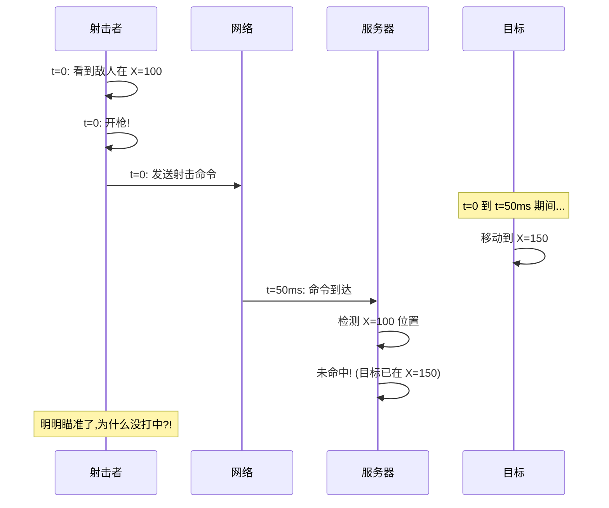
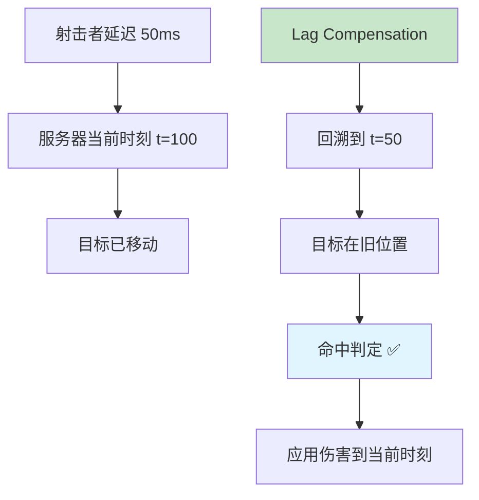
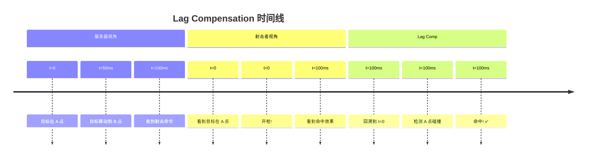
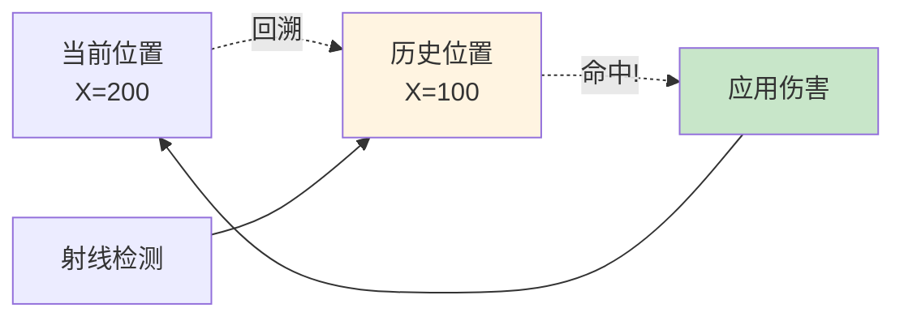
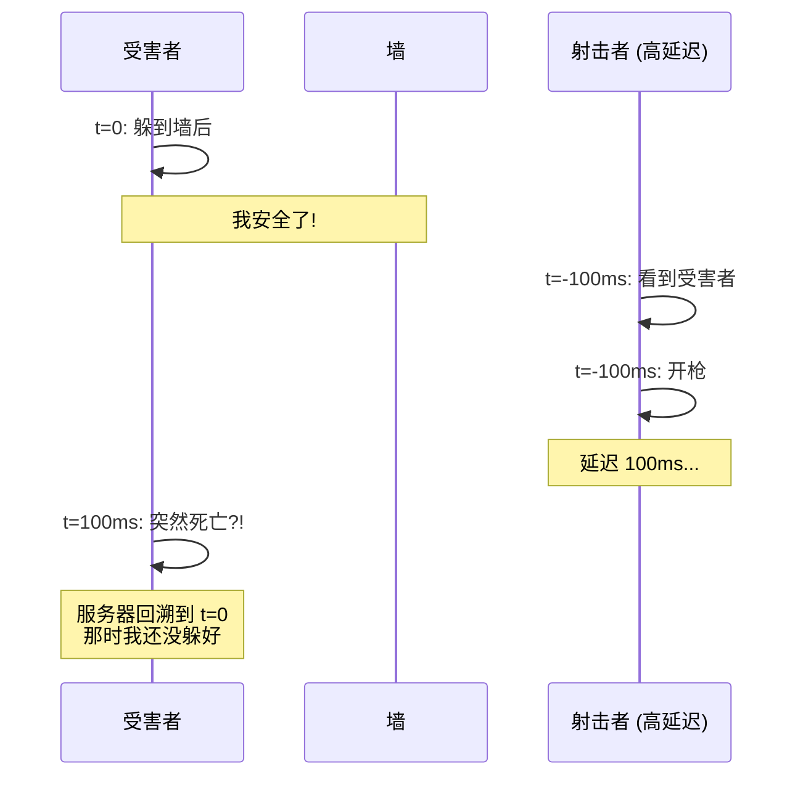
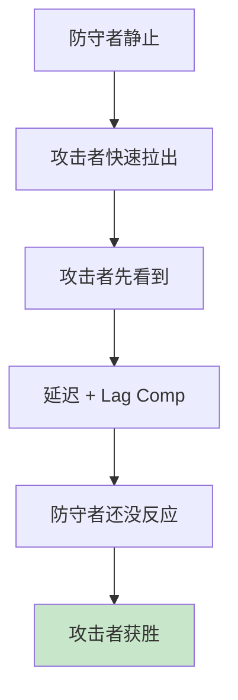
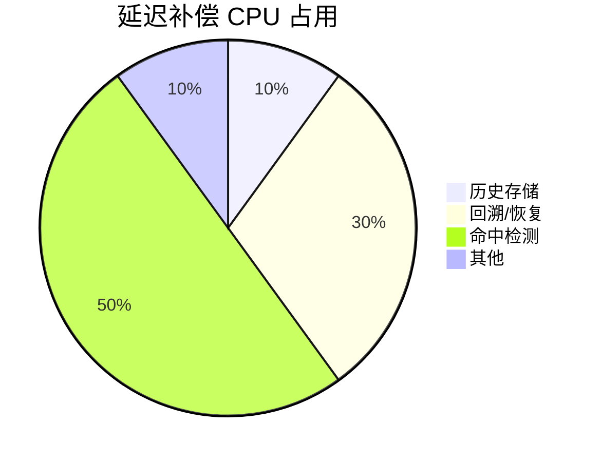

# ⏪ Lag Compensation - 延迟补偿

> [!abstract] 章节摘要
> **Lag Compensation** (延迟补偿) 是 Source Engine 最创新的技术之一。通过"**时间回溯 (Rewind)**"机制，服务器回滚所有玩家到射击者看到的历史时刻，确保"你看到的就是你打到的" (What You See Is What You Get)。

---

## 核心问题

### 无补偿的困境



> [!danger] 玩家视角
> - 我: "我准星明明在他头上!"
> - 服务器: "你开枪时他已经走了"
> - 结果: **未命中**

这会导致玩家**必须提前量**，预测敌人 50-100ms 后的位置，体验极差。

---

## Rewind 机制

### 基本原理



> [!success] 延迟补偿的承诺
> "你看到的 = 你打到的"，无需预判。

### 历史状态存储

```cpp
class CPlayerLagRecord {
public:
    float simTime;          // 模拟时间
    Vector origin;          // 位置
    QAngle angles;          // 角度
    Vector mins, maxs;      // 碰撞盒
    int flags;              // 状态标志
};

class CPlayerLagHistory {
    CUtlVector<CPlayerLagRecord> records;
    static const int MAX_RECORDS = 128;  // 保存最近 128 帧
    
    void StoreRecord(CBasePlayer* player);
    CPlayerLagRecord* GetRecordAtTime(float time);
};
```

---

## 补偿流程详解

### 步骤 1: 存储历史

```cpp
void StorePlayerHistory() {
    for (CBasePlayer* player : allPlayers) {
        CPlayerLagRecord record;
        record.simTime = gpGlobals->curtime;
        record.origin = player->GetAbsOrigin();
        record.angles = player->GetAbsAngles();
        record.mins = player->WorldAlignMins();
        record.maxs = player->WorldAlignMaxs();
        
        player->lagHistory.AddToHead(record);
        
        // 保持在限制内
        if (player->lagHistory.Count() > MAX_RECORDS) {
            player->lagHistory.RemoveTail();
        }
    }
}
```

### 步骤 2: 计算延迟

```cpp
float CalculatePlayerLatency(CBasePlayer* shooter) {
    // 客户端往返延迟
    float rtt = shooter->GetClientLatency();
    
    // 加上客户端插值延迟 (cl_interp)
    float interpDelay = shooter->GetInterpTime();
    
    // 总延迟
    float totalLatency = rtt + interpDelay;
    
    // 限制补偿范围 (防止作弊)
    return clamp(totalLatency, 0.0f, sv_maxunlag.GetFloat());
}
```

> [!important] sv_maxunlag
> 通常设置为 **0.2-1.0 秒**，防止玩家伪造高延迟获利。

### 步骤 3: 回溯世界

```cpp
void RewindPlayersToTime(float rewindTime, CBasePlayer* ignore) {
    for (CBasePlayer* player : allPlayers) {
        if (player == ignore) continue;  // 不回溯射击者
        
        // 找到最接近 rewindTime 的记录
        CPlayerLagRecord* record = player->lagHistory.GetRecordAtTime(rewindTime);
        
        if (record) {
            // 保存当前状态 (稍后恢复)
            player->SaveCurrentState();
            
            // 回溯到历史状态
            player->SetAbsOrigin(record->origin);
            player->SetAbsAngles(record->angles);
            player->SetCollisionBounds(record->mins, record->maxs);
        }
    }
}
```

### 步骤 4: 命中检测

```cpp
void ProcessLagCompensatedShot(CBasePlayer* shooter, CUserCmd* cmd) {
    // 1. 计算射击者的延迟
    float latency = CalculatePlayerLatency(shooter);
    float rewindTime = gpGlobals->curtime - latency;
    
    // 2. 回溯所有其他玩家
    RewindPlayersToTime(rewindTime, shooter);
    
    // 3. 执行射线检测
    Vector start = shooter->EyePosition();
    Vector forward;
    AngleVectors(cmd->viewangles, &forward);
    Vector end = start + forward * 8192.0f;
    
    trace_t tr;
    UTIL_TraceLine(start, end, MASK_SHOT, shooter, &tr);
    
    // 4. 如果命中,应用伤害
    if (tr.DidHit()) {
        CBasePlayer* victim = ToBasePlayer(tr.m_pEnt);
        if (victim) {
            victim->TakeDamage(weapon->GetDamage());
        }
    }
    
    // 5. 恢复所有玩家到当前状态
    RestorePlayersToNow();
}
```

---

## 可视化示例

### 射击时间线



### 碰撞盒回溯



---

## 实战优化

### 插值补偿

```cpp
// 精确回溯到两帧之间
CPlayerLagRecord* GetRecordAtTime(float targetTime) {
    // 找到前后两帧
    CPlayerLagRecord* older = nullptr;
    CPlayerLagRecord* newer = nullptr;
    
    for (auto& record : records) {
        if (record.simTime <= targetTime) {
            older = &record;
            break;
        }
        newer = &record;
    }
    
    if (!older || !newer) return older;
    
    // 插值
    float fraction = (targetTime - older->simTime) / (newer->simTime - older->simTime);
    
    CPlayerLagRecord interpolated;
    interpolated.origin = Lerp(older->origin, newer->origin, fraction);
    interpolated.angles = Lerp(older->angles, newer->angles, fraction);
    
    return interpolated;
}
```

### 选择性补偿

```cpp
// 不是所有武器都需要补偿
bool ShouldLagCompensate(CWeapon* weapon) {
    // 即时命中武器需要补偿
    if (weapon->IsHitscan()) return true;
    
    // 抛射物不需要 (本身有飞行时间)
    if (weapon->IsProjectile()) return false;
    
    // 近战武器需要
    if (weapon->IsMelee()) return true;
    
    return false;
}
```

---

## 副作用与权衡

### 被"墙角"击杀



> [!warning] 争议场景
> 高延迟玩家可以"射杀你看不见的自己"。这是 Lag Compensation 的代价。

### Peekers Advantage (窥视优势)



> [!question] 平衡问题
> 这导致激进进攻比防守有优势，游戏设计需要考虑。

---

## 作弊防护

### 延迟伪造

```cpp
// 防止玩家伪造高延迟
void ValidateLatency(CBasePlayer* player) {
    float reportedLatency = player->GetClientLatency();
    float measuredLatency = MeasureRealLatency(player);
    
    if (reportedLatency > measuredLatency * 1.5f) {
        // 可能作弊: 声称延迟异常高
        KickPlayer(player, "Invalid latency");
    }
}
```

### 补偿范围限制

```cpp
// sv_maxunlag 限制
float clampedLatency = clamp(latency, 0.0f, 1.0f);  // 最多补偿 1 秒

// 防止 "lag switch" 作弊
if (latency > 0.5f && player->IsMoving()) {
    // 高延迟 + 移动 = 可疑
    LogSuspiciousActivity(player);
}
```

---

## 性能考虑

### 内存占用

```cpp
// 每个玩家
sizeof(CPlayerLagRecord) = 64 bytes

// 128 帧历史
128 * 64 = 8 KB per player

// 64 玩家服务器
64 * 8 KB = 512 KB 总内存

// 可接受的开销
```

### CPU 开销



> [!tip] 优化
> - 只回溯可见玩家
> - 使用空间分割加速射线检测
> - 缓存插值结果

---

## 配置变量

| ConVar | 默认值 | 说明 |
|--------|--------|------|
| `sv_maxunlag` | 1.0 | 最大补偿延迟 (秒) |
| `sv_lagcompensation` | 1 | 启用延迟补偿 |
| `sv_lagcompensation_teleport_dist` | 64 | 瞬移距离阈值 |

---

## 相关链接

- Previous: [[07_Display_of_Targets|目标显示]]
- Next: [[09_Game_Design_Implications|游戏设计影响]]
- Related: [[04_Client_Prediction|客户端预测]]

---

#source-engine #lag-compensation #rewind #hit-detection #valve

^lag-compensation
